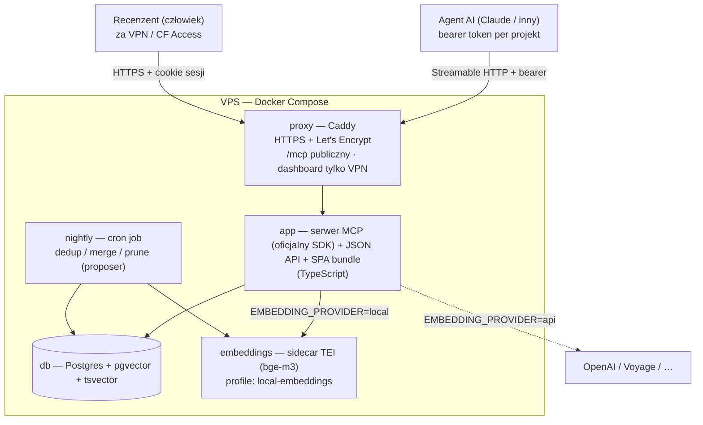

# Context Keeper — Tech Stack & Architektura

**Wersja dokumentu:** v1.3 (dostęp: wiele tokenów per projekt + graceful rotation) · **Data:** 2026-07-27
**Źródła:** `plan-pamiec-agentow-mcp.md`, `research-prior-art-pamiec-agentow.md`, sesja ustaleń przedimplementacyjnych

> Ten dokument opisuje **jak** budujemy. Uzasadnienia produktowe (co i dla kogo) są w [`prd.md`](prd.md).
> Zasada przewodnia: **prosto w v1, schema/architektura gotowa na rozszerzenia.**

---

## 0. Changelog

### v1.3 — dostęp: wiele tokenów per projekt + graceful rotation

1. **`project_tokens` zamiast trzech kolumn tokena na `projects`** — 1 projekt → N tokenów, etykieta
   WYMAGANA przy tworzeniu (atrybucja per-agent), unikalna wśród aktywnych tokenów (partial unique
   index). → §4
2. **Rotacja graceful, token-scoped** (zastępuje hard-cutover v1) — nowy token wydany obok starego,
   stary wchodzi w `grace` i wygasa lazily po `TOKEN_GRACE_PERIOD_HOURS` (bez nocnego sweepu, jedna
   reguła usability dzielona przez auth i dashboard/CLI). `revoke` osobna, natychmiastowa akcja dla
   skompromitowanych danych. → §4, §10, §12
3. **Atrybucja per-agent** — `search_events.token_id` + `audit_log.metadata.{tokenId,tokenLabel}`
   (`actor` pozostaje `agent:<project_id>`, niezmieniony); rate limiting per-`token_id` zamiast
   per-`project_id`. → §4, §10

### v1.2 — domknięcia stacku (framework, embeddingi, proxy, instalator)

1. **Framework hosta wybrany** — NestJS na adapterze Express; DI (provider embeddingów), Guardy (dwie powierzchnie auth), Interceptory (audyt/rate-limit); `nestjs-commander` (CLI), standalone context (nightly). → §2, §9
2. **Presety embeddingów** — trzy zwalidowane profile deploy-time (`multilingual`/`english`/`api`) zamiast surowego knoba modelu; CLI `reembed` dla zmiany presetu. → §7, §9, §12
3. **Reverse proxy opcjonalny** — Caddy w compose profile `edge-proxy`; tryb bring-your-own-proxy (homelab) + `TRUST_PROXY` + rozdzielne porty MCP/dashboard. → §3, §9, §12
4. **Instalator onboardingu** — interaktywny `install.sh` generujący `.env` + sekrety + wybór profili; uruchomienie stacku opcjonalne (prompt tak/nie, default = tylko generacja). → §9

### v1.1 — ustalenia przedimplementacyjne

Uzupełnienia wpięte in-place w sekcje poniżej (sesja domykania planu przed kodem):

1. **Kontrakt z agentem 3-warstwowy** — opisy narzędzi MCP (pełny kontrakt, uniwersalne) + snippet do `CLAUDE.md`/`AGENTS.md` (v1) + plugin (v1.1). → §5, §14
2. **Degradacja embeddingów** — fail-open na obu ścieżkach; twardy budżet czasu na `save`. → §6, §7, §11
3. **Współbieżność kolejki** — optimistic concurrency (base-version stamping) + row-lock w transakcji akceptacji; stale = blokada + badge. → §4, §8bis
4. **Ręczne tworzenie pamięci + przełącznik kontekstu** — human-create (paste + import `.md`); context switcher `Wszystkie`/`Global`/projekt. → §4, [`prd.md`](prd.md) §6.4
5. **Dedup advisory + supersession** — twardy `duplicate_pending` tylko exact-match; „Zatwierdź jako zamiennik [X]"; `conflicts_report` → v2. → §5
6. **Auth klienta MCP zweryfikowany** — statyczny bearer wystarcza (Claude Code potwierdzony); OAuth → roadmapa. → §5, §10
7. **Limity wejścia + walidacja** — per-kind body cap, normalizacja tagów, header. → §4, §5
8. **Sekrety/PII + hard-purge** — skaner (agent=block / human=warn), `secret_blocked` jako sygnał rotacji, purge CLI. → §10
9. **Taksonomia błędów MCP + idempotencja** — isError vs HTTP, `scope→not_found`, hash-idempotencja (`already_exists`). → §5
10. **Semantyka nocnego jobu** — lock, stateless idempotentny re-scan, samosprzątanie stale, harmonogram, ręczny trigger. → §8
11. **Token** — `ck_` + 256-bit, SHA-256 indeksowany (bez pepper), rotacja hard-cutover. → §4, §10
12. **Oficjalny MCP SDK** (`@modelcontextprotocol/sdk`), nie hand-roll. → §2, §5
13. **Strategia testów** — skupiona na rdzeniu poprawności/bezpieczeństwa, bez pełnego pokrycia. → §15

---

## 1. Przegląd architektury

Jeden VPS, Docker Compose, jedna baza (Postgres) jako jedyne źródło prawdy. Serwer MCP i dashboard w jednym procesie `app`. Embeddingi liczone lokalnie (domyślnie) lub przez API — za jednym interfejsem providera.

**Charakterystyka:** app-tier bezstanowy na poziomie logiki (narzędzia MCP są request/response). Ale sidecar modelu (RAM) i rate-limiter w pamięci trzymają stan → **serverless nie jest bliską ścieżką**; skalowanie poziome wymagałoby przeniesienia rate-limitera do współdzielonego store (np. Redis) — poza v1.

**Tryb degradacji (nowe):** provider embeddingów down = stan **degraded, nie unhealthy** — `app` zostaje „up", bo obie ścieżki działają dalej (save tworzy proposal bez embeddingu, search leci FTS-only). Szczegóły w §6/§7/§11.

---

## 2. Stack technologiczny

| Warstwa | Technologia | Uzasadnienie |
|---|---|---|
| **Backend / MCP** | TypeScript + **oficjalny `@modelcontextprotocol/sdk`**, host **NestJS (adapter Express)**, jeden proces | SDK obsługuje protokół i transport Streamable HTTP (POST+GET, initialize, tools/list, tools/call, sesje) i śledzi rewizje spec — nie reimplementujemy zgodności ręcznie. NestJS bo cztery powierzchnie w jednym kodzie: **DI** dla abstrakcji providera embeddingów (§7), **Guardy** dla dwóch rozłącznych auth (`BearerGuard` na `/mcp`, `SessionGuard` na dashboardzie — §10), **Interceptory** dla audytu/rate-limitu, `nestjs-commander` dla CLI i standalone context dla nocnego jobu (reużycie tych samych serwisów co ścieżka akceptacji — §8bis). Adapter **Express** (nie Fastify) — przy tej skali DB+embedding dominują latencję, więc wybieramy najlepiej przetartą kompatybilność transportu SDK. Transport montowany jako controller `/mcp` (`@Post/@Get/@Delete` → `transport.handleRequest`), mapa transportów per-sesja jako singleton-provider. |
| **Baza + wektory + FTS** | Postgres + `pgvector` + wbudowany `tsvector` | Jedna baza, transakcyjnie, bez dedykowanej bazy wektorowej. HNSW ciągnie setki tysięcy wektorów na tej skali. |
| **Embeddingi (local)** | TEI (HuggingFace Text Embeddings Inference), model **bge-m3** (1024 dim, multi-język) — domyślny preset | Treść pamięci mieszana PL/EN; modele EN-only gubią dopasowania po polsku. Alternatywa sidecara: Ollama. **Preset `english` (bge-small-en, 384 dim) jako świadomy wybór deploy-time dla treści EN-only — §7.** |
| **Embeddingi (api)** | OpenAI / Voyage / … za tym samym interfejsem providera | Wybór per deployment (`EMBEDDING_PROVIDER`), nie per-request. |
| **Frontend / dashboard** | SPA React + JSON API | Build SPA = krok w obrazie compose; assety serwuje `app` na tym samym origin. |
| **Reverse proxy** | Caddy (**opcjonalny**, compose profile `edge-proxy`) | Terminacja HTTPS + auto Let's Encrypt; rozdziela ekspozycję (`/mcp` publiczny, dashboard/API tylko VPN/CF Access). Profil off = **bring-your-own-proxy** (istniejący Traefik/nginx/Caddy/CF Tunnel w homelabie); wtedy `TRUST_PROXY` + rozdzielne porty MCP/dashboard (§9). |
| **Deployment** | Pojedynczy VPS + Docker Compose | Najprościej i przewidywalnie w v1; stabilny publiczny endpoint HTTPS wymagany przez remote MCP. |
| **Job** | cron/scheduled kontener `nightly` | Dedup/merge/prune jako proposer. |
| **Migracje** | narzędzie migracyjne od dnia zero | Schema to kilka powiązanych tabel + rozszerzalny enum `kind`. |
| **Testy** | unit + integration na efemerycznym Postgresie (testcontainers) + `recall@k` + cienki MCP e2e | Skupione na rdzeniu poprawności/bezpieczeństwa, nie pełne pokrycie (§15). |

---

## 3. Serwisy Docker Compose

| Serwis | Rola |
|---|---|
| `proxy` | Caddy — HTTPS, routing, rozdział ekspozycji publiczny/VPN. **Opcjonalny (compose profile `edge-proxy`);** off = bring-your-own-proxy (§9). |
| `db` | Postgres + `pgvector`. |
| `app` | Serwer MCP (Streamable HTTP przez oficjalny SDK, bearer) + JSON API dashboardu (sesja) + statyczny bundle SPA — trzy powierzchnie, jeden origin. |
| `nightly` | Cron job dedup/merge/prune (proposer). |
| `embeddings` | **Opcjonalny** sidecar modelu lokalnego (TEI/bge-m3). W **compose profile** `local-embeddings` — startuje tylko przy `EMBEDDING_PROVIDER=local`; przy `api` się nie podnosi. |

---

## 4. Model danych

Jeden dyskryminator `kind` na tabeli `memories` (nie osobne tabele — reużycie `embeddings`/`proposals`/`revisions`, jedna ścieżka retrievalu i chunkingu). `kind` opisuje czym pamięć **jest**; autorstwo trzyma osobne pole `source`.

### `memories` (dokument kanoniczny)

| pole | opis |
|---|---|
| `id` | krótki, opaque, URL-safe (nanoid, np. `mem_a1b2c3`); stabilny — to dostaje agent w search i podaje do get |
| `header` | krótki tytuł/streszczenie; to zwraca search. **Limit ~200 znaków, jednolinijkowy** (strip newline) |
| `body` | pełna treść (markdown). **Limit per `kind`:** `fact` ~8 KB (~2k tok.), `document` ~256 KB (§5) |
| `kind` | `fact` \| `document` \| `event` (rozszerzalny enum; `event` zaimplementowane w v1.2) |
| `tags` | lista stringów. **Normalizacja:** trim + lowercase + collapse whitespace; max ~10, każdy ≤ ~40 zn., charset `[a-z0-9-_/]` |
| `scope` | `global` \| `project` |
| `project_id` | z credentialu przy zapisie (agent) lub z aktywnego kontekstu UI (human-create); pusty dla `global` |
| `status` | `approved` \| `archived` (soft-delete, nigdy hard-delete; wyjątek = hard-purge §10) |
| `source` | `agent` \| `human` \| `nightly` (kto utworzył) |
| `created_at` / `updated_at` / `approved_at` | znaczniki czasu |
| `last_accessed_at` / `access_count` | feed dla prune; zbierane od dnia zero, nie do odtworzenia wstecz |
| `event_time` | (v1.2) **wyłącznie `kind=event`** — nullable, backdatable znacznik KIEDY zdarzenie się wydarzyło (osobny od `created_at` = kiedy wpis powstał w pamięci). Ustawiany raz przy tworzeniu (edycja po fakcie poza zakresem v1). Napędza sortowanie ekranu „Oś czasu" i age-decay w rankingu retrievalu. |

- `fact` = fakty accreted przez agenta (mutowalne, podlegają dedup/supersession/prune).
- `document` = dokumenty authored przez człowieka (PRD, roadmap) — kanon, permanentne, poza zasięgiem nocnego joba. Od v1.2 agent może *zaproponować* nowy `document` przez `save_memory` (`kind='document'`, human-gated jak każdy proposal); **edycja istniejącego dokumentu przez agenta pozostaje poza zakresem** (agent-update → osobne zadanie roadmapy).
- `event` = zdarzenia ze stemplem czasu (v1.2) — **tworzone wyłącznie przez człowieka** w dashboardzie (`save_memory` agenta go nie eksponuje). W rankingu retrievalu podlegają age-decay (wykładniczy half-life, `EVENT_DECAY_HALFLIFE_DAYS`, aplikowany post-RRF, zero wpływu na fact/document). Domyślnie **wyłączone** z domyślnego `kind` w `search_memory` — per-projektowy boolean `projects.include_events_in_default_search` (dialog szczegółów projektu, §9.3) je włącza; `kind=event` jawny w zapytaniu działa zawsze niezależnie od togglea.
- Model 2D: `scope` × `kind` (`document` może być `global` = glossary/standard, lub `project` = PRD tego projektu).

### `embeddings` (jeden-do-wielu — chunking)

`memory_id`, `chunk_index`, `chunk_text`, `embedding_model`, `vector`. Mały dokument = jeden chunk (chunking wtedy niewidoczny). Jedna ścieżka kodu dla małych i dużych.

### `proposals` (kolejka akceptacji — każda treściowa mutacja)

`type` (`create`\|`update`\|`merge`\|`delete`), `payload`, `affected_ids`, `origin` (`agent`\|`human`\|`nightly`), `status` (`pending`\|`approved`\|`rejected`).

- Kolejka to **tabela**, nie flaga `status=pending` na dokumencie — bo merge (A+B→C) to operacja „utwórz C, zarchiwizuj A, zarchiwizuj B", której flaga nie wyrazi. Jeden mechanizm i jedna powierzchnia audytu dla zapisów agenta, edycji człowieka i propozycji nocnego joba.
- **Optimistic concurrency (nowe):** proposal celujący w istniejące pamięci zapisuje przy utworzeniu **`base_versions`** — `revision_id` bazowy każdego `affected_id` (stan, względem którego liczono payload). Przy akceptacji sprawdzany wewnątrz transakcji (§8bis). Drift → proposal jest **stale** (computed guard, bez nowej wartości w enumie `status`).
- **Idempotencja / dedup (nowe):** twardy `duplicate_pending` tylko przy **exact match** `hash(header+body+scope+project+kind)` wobec pending proposala; exact-match do approved → `already_exists`; podobne → proposal + hint (§5).

> **Forward-compat (v2):** miejsce na pole `confidence`/`auto_eligible` (anti-fatigue / sedymentacja).

### `revisions`

Lekkie snapshoty przy każdej zatwierdzonej zmianie (żeby widzieć „co tu było wcześniej", zwłaszcza po przepisaniu przez nocny job). Strategia: pełny snapshot dla `fact` (małe, tanie); dla dużych `document` rozważyć snapshot różnicowy (diff) — knob. **Supersession** (zamiennik pamięci przez człowieka) linkowany w `revisions` — patrz „Zatwierdź jako zamiennik" (§5).

### `staging_embeddings`

Wektory policzone przy `save` (dla dedup), zanim proposal zostanie zatwierdzony. Ta sama struktura co `embeddings`, kluczowane `proposal_id`. Przy akceptacji przenoszone do `embeddings`; przy odrzuceniu/edycji — kasowane/liczone od nowa. **Może być puste** (embedding provider down przy save, §7) → autorytatywny embedding liczony przy akceptacji.

### `audit_log` (append-only)

`id`, `event_type`, `actor` (token+`project_id` albo `"human-dashboard"`), `affected_ids`, `revision_id` (opcjonalnie, before/after), `created_at`. Odczyty **nie** logowane per-event — zostają liczniki.

- **event_type:** `proposal_created`/`approved`/`rejected`/`edited`, `human_edit`, `archive`, `promote`, `token_created`/`rotated`/**`revoked`**/**`relabeled`** (v1.3 — `revoked`=unieważnienie natychmiastowe, `relabeled`=rename etykiety, kosmetyczny), **`secret_blocked`** (metadane: typ sekretu + `tokenId`/`tokenLabel` (v1.3, atrybucja per-agent) + czas — bez materiału sekretu; sygnał rotacji/unieważnienia, §10), **`purge_tombstone`** (content wymazany, powód, czas — §10), **`nightly_run`** (status/liczniki, §8), **`project_settings_changed`** (v1.2 — zmiana ustawień projektu z dialogu szczegółów, np. `include_events_in_default_search`; metadane `{field, from, to}`).

### `projects`

Projekty. Dodanie projektu bez redeployu.

- `include_events_in_default_search` (v1.2) — boolean, default `false`. Per-projektowy toggle: czy `kind=event` dokłada się do domyślnego zestawu `kind` w `search_memory` (agent nadal może zawsze poprosić o `kind=event` jawnie). Edytowany w dialogu szczegółów projektu (§9.3); zmiana audytowana jako `project_settings_changed`.

### `project_tokens` (v1.3 — wiele tokenów per projekt + graceful rotation)

1 projekt → N tokenów (dawniej trzy kolumny tokena bezpośrednio na `projects` — 1:1). **Token: `ck_` +
256-bit losowość (base64url); w bazie `token_hash` = SHA-256 (deterministyczny, indeksowany), bez
pepper.** Lookup token→(projekt, token) = jeden trafiony indeks JOIN (§10).

- `label` — **WYMAGANA** przy tworzeniu (atrybucja per-agent — który token zapisał/wyszukał), unikalna
  per projekt **wśród aktywnych** tokenów (partial unique index `(project_id, label) WHERE
  status='active'` — jedyna scoping, która przeżywa rotację: kopia w `grace` niesie tę samą etykietę
  co jej zamiennik). Rename po utworzeniu wystawiony (`PATCH`, kosmetyczny, nie dotyka usability).
- `status` — `active` / `grace` / `revoked` (enum `project_token_state`). **`expired` NIE jest
  persystowany** — pochodna `grace` + `expires_at <= now()`, liczona lazily przy KAŻDYM auth lookupie
  i przy renderze dashboardu/CLI z jednej reguły (`effectiveTokenStatus`, dzielona z SQL-owym
  predykatem usability) — bez nocnego sweepu, więc bez okna, w którym wygasły token wciąż
  autentykuje.
- **Rotacja jest TOKEN-scoped, nie project-scoped:** `rotateToken(tokenId)` przenosi JEDEN token do
  `grace` (`expires_at = now() + TOKEN_GRACE_PERIOD_HOURS`, domyślnie 72h) i mintuje zamiennik z tą
  samą etykietą — pozostałe tokeny projektu (inni agenci) nietknięte. `revokeToken(tokenId)` jest
  osobna, natychmiastowa akcja (dla skompromitowanych danych) — działa na `active` i `grace`,
  idempotentna.
- `search_events.token_id` (nullable, `ON DELETE SET NULL`) + `audit_log.metadata.{tokenId,tokenLabel}`
  niosą atrybucję per-agent — `audit_log.actor` pozostaje `agent:<project_id>` (format aktora
  niezmieniony, żeby nie złamać filtra `AuditService.query` po projekcie).
- Rate limiting (§10) kluczowany `token_id`, nie `project_id` — N agentów per projekt dostaje N
  niezależnych budżetów zamiast dzielenia jednego.

### Ścieżka human-create (nowe)

`source=human` → **commit bezpośredni + revision, z pominięciem kolejki** (FR-Q4). Reużywa tej samej logiki materializacji co akceptacja proposala (chunking + embed + insert `memories` approved + `embeddings` + `revision` + `audit`), tylko prosto do `embeddings` (bez staging). Embedding z tym samym fail-open + budżetem czasu (§7).

### Forward-compat (v2, miejsce w schemie już teraz)

- Tabela `outcome` (analogicznie do `embeddings`/`revisions`) — dla Memory Worth (`report_outcome`).
- Tabela relacji (memory-relations + 1-hop graph boost, roadmap) — schema i `revisions`
  zaprojektowane tak, żeby doszła bez bolesnej migracji; kluczowana `memory_id`, ortogonalna do
  `event_time` (v1.2, już zaimplementowane — patrz §4 `kind=event`). Graph boost komponowałby się
  post-fuzją z age-decay, nie konkurował.
- Pole `confidence`/`auto_eligible` w `proposals` — anti-fatigue.

---

## 5. Interfejs MCP

- **Transport: Streamable HTTP** przez **oficjalny `@modelcontextprotocol/sdk`**, jeden endpoint (POST+GET). Stary HTTP+SSE przestarzały (spec 2025-03-26); najnowsza rewizja transportu 2025-11-25 — SDK ją śledzi. Narzędzia request/response → app-tier bezstanowy.
- **Auth: statyczny bearer token per projekt** w nagłówku `Authorization`; serwer mapuje token → `project_id`. **Zweryfikowane (nowe):** Claude Code CLI łączy się po `--header "Authorization: Bearer …"`; `.mcp.json` = `type:"http"` (alias `streamable-http`), `url`, `headers`; wspierana ekspansja `${VAR}` (token w env, nie plaintext w commicie); serwer odrzucający header → deterministyczny fail (bez cichego fallbacku do OAuth). **OAuth 2.1 + PKCE → roadmapa** (gdyby serwer stał się publiczny / potrzebny Desktop/web-connector); kod bearer się nie marnuje.

### Narzędzia

| Narzędzie | Sygnatura | Uwagi |
|---|---|---|
| `search_memory` | `(query, tags?, kind?)` → `[{id, header, tags, score}]` | Scope z tokena. Domyślnie `fact`+`document` (+ `event`, v1.2, TYLKO gdy projekt ma `include_events_in_default_search=true`); opcjonalny filtr `kind` (`fact`\|`document`\|`event`) honorowany zawsze niezależnie od togglea. Dla `document` dokłada excerpt dopasowanego chunku; dla `event` ranking podlega age-decay (§4). Przy embedding-down → **FTS-only** (§6), ciche. |
| `get_memory` | `(id)` → pełne body | Bumpuje `last_accessed_at`/`access_count`. **Egzekwuje scope** (`id` ∈ projekt tokena albo `global`). Poza scope **lub** nieistniejące → identyczne **`not_found`** (anty-probing IDOR). |
| `save_memory` | `(header, body, tags)` → `{id, status}` | Liczy embedding + dedup przed odpowiedzią z **twardym budżetem czasu** (po timeoucie → `pending` bez embeddingu, doembed przy akceptacji). `id` mintowany przy proposalu; wiersz `memories` materializowany dopiero przy akceptacji. Statusy: `pending` / `duplicate_pending` / `already_exists`. |

### Dedup / idempotencja (advisory, nie hard-block)

Embedding-similarity **nie odróżnia** korekty od duplikatu („PG15"→„PG16", negacja) → auto-suppression po podobieństwie jest niebezpieczne (jego failure mode to korekty). Dlatego:

- exact `hash(header+body+scope+project+kind)` == pending proposal → **`duplicate_pending`** (id proposala; łapie retry sieciowy),
- exact == approved memory → **`already_exists`** (id pamięci),
- **podobne-ale-nie-exact → proposal ZAWSZE powstaje** + hint „similar to [ids]" dla recenzenta,
- nowe → create.

Bez client-supplied idempotency key w v1 (hash treści wystarcza).

### Taksonomia błędów

Błędy *wykonania narzędzia* → wynik z **`isError: true`** + koperta `{code, message}` (agent czyta i się adaptuje). Błędy *transportu/auth* → **status HTTP** (obsługuje klient).

| Warstwa | Przypadek | `code` / status |
|---|---|---|
| Tool-level (`isError`) | walidacja poza limitem / braki | `validation_error` |
| | sekret wykryty przy save | `secret_blocked` (agent; „usuń sekret, referuj po nazwie") |
| | `get_memory` poza scope lub nieistniejące | `not_found` (nieodróżnialne — anty-probing) |
| Transport (HTTP) | zły/brak bearer | `401` |
| | rate limit | `429` + `Retry-After` |
| Nie-błąd (status w wyniku) | save | `pending` / `duplicate_pending` / `already_exists` |
| | search przy embedding-down | ciche FTS-only |

`code` stabilne (snippet/plugin i agenci mogą się na nich opierać); komunikaty tekstowe mogą się zmieniać.

### Semantyka zapisu

- **Async ack — fire-and-forget.** Agent nie czeka, nie pollinguje; gate decyduje tylko o widoczności dla przyszłych sesji.
- **Zapisy agenta: tylko project-scoped.** Promocja do `global` = akcja człowieka.
- **Agent tylko tworzy (`create`) w v1.** Aktualizacja przez agenta — v2 (ewentualnie `supersedes: id`). Korekta faktu w v1 = nowy `create` + human-mediated supersession („Zatwierdź jako zamiennik [X]" w dashboardzie).

---

## 6. Retrieval pipeline

1. **Embed query** tym samym providerem co zapisy (przy `api` = koszt + egress treści query per search). **Przy embedding-down → pomijamy ramię wektorowe, lecimy FTS-only** (RRF na jednej liście); zwracamy wyniki (dokładne tokeny techniczne działają), log + metryka, bez sygnału do agenta.
2. **Wektor** na chunkach (`pgvector`, HNSW) — semantyka, synonimy, fleksja PL/EN. **Collapse**: trafienia chunków grupowane po `memory_id`, najlepszy score na dokument.
3. **FTS** na całym dokumencie (`tsvector`, konfiguracja **`simple`** — bez stemmingu, żeby nie masakrować mieszanki PL/EN; fleksję/semantykę bierze wektor bge-m3, FTS zostaje przy dokładnym trafieniu tokenu technicznego).
4. **Fuzja RRF** (Reciprocal Rank Fusion) list *dokumentów* — bez tuningu wag, stała `k` (typowo 60).
5. **Filtr aktywnego modelu:** `WHERE embedding_model = <aktywny>` (podczas re-embedu modele współistnieją, przestrzenie nieporównywalne).
6. **Top-k + próg relevance** (odcięcie szumu).
7. **Dwufazowo:** `search_memory` → nagłówki (+ excerpt dla `document`); `get_memory(id)` → pełne body (v1 = całość). Chunk-targeted `get` → v2.

**Tagi:** podwójna rola — filtr strukturalny w search + tekst dopisany do embeddowanego chunku.

**Eval (v1-light):** mały labelowany zestaw `zapytanie → oczekiwane memory_id` + skrypt `recall@k` jako smoke-test regresji przy zmianach chunkingu/progów/modelu.

**Bezpieczeństwo retrievalu:** świadomość ataku rank-0 injection w fuzji hybrydowej (przebadane na RRF/MAX/weighted). Bramka akceptacji jest tu przewagą — zatruta pamięć musi przejść approve, zanim wpłynie na wyniki.

---

## 7. Embeddingi — abstrakcja providera

- **Jeden interfejs providera, dwie implementacje.** `local` → sidecar TEI w sieci compose; `api` → OpenAI/Voyage/…. `EMBEDDING_PROVIDER` w env przełącza; **jedna ścieżka kodu** w retrievalu.
- **Wybór per deployment, `local` domyślny.** Nie per-request: różne modele = różny wymiar i nieporównywalna przestrzeń. Zmiana modelu = `ALTER` kolumny `vector` (stały wymiar) + re-embed wszystkiego + rebuild HNSW. „Wspierane" = kod obu ścieżek gotowy, **nie** tani runtime-swap.
- Schema zapisuje `embedding_model` przy każdym wektorze od dnia zero → gotowość na hot-swap z re-embedem w przyszłości.
- **Domyślny model lokalny: bge-m3** (multi-język, 1024 dim, ~2–4 GB RAM). GPU niepotrzebne przy tej skali (embedowanie tylko przy zapisach i zapytaniach).

### Presety embeddingów (wybór deploy-time)

Trzy zwalidowane presety zamiast surowego knoba `EMBEDDING_MODEL` — każdy spina `EMBEDDING_PROVIDER`+`EMBEDDING_MODEL`+`EMBEDDING_DIM` spójnie (autorytatywne pozostają te trzy zmienne; preset to wygoda instalatora, który je wypisuje), żeby operator nie rozjechał wymiaru z kolumną `vector`:

| Preset | Provider | Model | Dim | VPS (§9) | Dla kogo |
|---|---|---|---|---|---|
| `multilingual` (**default**) | local (TEI) | bge-m3 | 1024 | ~8 GB | treść mieszana PL/EN — najbezpieczniejszy |
| `english` (lean) | local (TEI) | bge-small-en-v1.5 / gte-small | 384 | ~4 GB | treść EN-only — szybszy, mniejszy indeks/HNSW |
| `api` | api | OpenAI 3-small (przez param `dimensions`) / Voyage | 1024 | ~2 GB | offload compute, kosztem egressu treści query |

- **Decyzja deploy-time, nie runtime-toggle ani per-request** (jak wyżej: różne modele = różny wymiar, nieporównywalna przestrzeń). Preset `english` to legalna optymalizacja dla treści pewnie angielskiej; dev-memory bywa jednak mieszane (identyfikatory, snippety) → `multilingual` zostaje domyślny, a hybrydowy FTS (`simple`, §6) łapie dokładne tokeny techniczne niezależnie od modelu.
- **Zmiana presetu po zapisaniu danych = migracja re-embed**, nie edycja env: `ALTER` kolumny `vector` + przeliczenie wszystkich wektorów + rebuild HNSW. Wystawione jako **CLI `reembed`** (§9), żeby była to operacja wspierana, nie ręczny `ALTER`. Instalator (§9) odmawia cichej zmiany `EMBEDDING_DIM` pod istniejącymi danymi i kieruje na `reembed`.

### Degradacja — fail-open na obu ścieżkach (nowe)

- **`save_memory`:** przechwycenie faktu jest święte — embedding **nigdy nie blokuje proposala**. Provider up → staging embedding + dedup-hint. Provider down / **przekroczony twardy budżet czasu** → proposal i tak powstaje (bez staged wektora), agent dostaje szybko `pending`, **autorytatywny embedding liczony przy akceptacji**. Invariant: *autorytatywny embedding gwarantowany przy akceptacji; embedding przy save = best-effort pod dedup-hint*.
- **`search_memory`:** query embedding padł → **FTS-only** (§6), nie błąd.
- **`/health`:** provider embeddingów down = **degraded, nie unhealthy** — `app` zostaje „up". Zdrowie providera jako osobna metryka w dashboardzie (§11).

### Cykl życia embeddingu (save → approval)

Wektor liczony przy `save` (dla dedup) → `staging_embeddings` (powiązany z proposalem) → **akceptacja przenosi** go do `embeddings` + materializuje wiersz `memories` → **edit-before-approve unieważnia staged wektor → re-embed** przy akceptacji → odrzucenie kasuje staging. **Brak staged wektora (provider down przy save) zbiega się z tą samą ścieżką „policz przy akceptacji" — zero nowego schematu.** Bez podwójnego liczenia w happy-path.

---

## 8. Nocny job (dedup / merge / prune)

- **Proposer, nie executor** — wyniki do `proposals` z diffem, zatwierdzane jak zwykły zapis. Cichy merge/delete byłby najgorszym failure mode (potwierdzone przestrogą z prior-art: autonomiczna konsolidacja po cichu zarchiwizowała 76+ pozycji).
- Działa **tylko na `kind=fact`**.
- **Skanuje wszystko, scala wąsko** — tylko przy prawdziwym pokryciu tego samego pojedynczego tematu (ochrona przed papką; gate to backstop, heurystyka chroni sygnał/szum w kolejce).
- **Dedup przez ANN** (near-neighbors per pamięć przez indeks wektorowy), nie O(n²). Deterministyczny i tani; merge/rewrite przez LLM i tak wymaga przeglądu.
- **Prune/staleness** korzysta z `last_accessed_at`/`access_count`, z minimalnym **wiekiem/grace** przed kwalifikacją (świeży `fact` ma z natury niski `access_count`).
- **Pluggable score:** job czyta abstrakcyjny score; v2 podmienia recency → success/failure co-occurrence (Memory Worth) bez migracji.
- **`conflicts_report` (wykrywanie sprzeczności same-topic) → v2** — wymaga wiarygodnego sądu LLM o kontradykcji (wysoki false-positive); v1 zostaje przy dedup near-identical + prune.

### Semantyka operacyjna (nowe)

1. **Lock jednej instancji** — `pg_advisory_lock` (albo wiersz `nightly_runs` ze statusem). Nakładający się trigger = no-op + log „skipped".
2. **Stateless full re-scan każdej nocy, idempotentny, bez checkpointów.** Job wyprowadza propozycje z bieżącego stanu bazy; awaria w połowie nie zostawia niespójnego stanu (**bo job tylko proponuje, nie mutuje** — atomowy apply jest przy akceptacji); brakujące propozycje wracają jutro.
3. **Idempotentne + samosprzątające proponowanie** (higiena kolejki): równoważny **ważny** pending-nightly proposal istnieje → pomiń (zero churnu); istnieje ale **stale/nieaktualny** → withdraw (audit) + re-derive jeśli warunek trwa; brak → create. Job dotyka **wyłącznie własnych** nightly-proposali (nigdy human/agent).
4. **Harmonogram:** cron konfigurowalny (env), domyślnie ~03:00 czasu operatora (TZ konfigurowalna). Przy ANN job ~liniowy (minuty).
5. **Ręczny trigger:** CLI `run-nightly` w v1 (przycisk w dashboardzie → v1.1), respektuje ten sam lock.
6. **Observability:** event `nightly_run` — status (success/failed/skipped-locked), start/end/duration, liczniki (created/withdrawn/skipped-as-dup) — w dashboardzie (§11).

---

## 8bis. Write path — akceptacja i współbieżność (nowe)

- **Zatwierdzenie aplikuje zmianę transakcyjnie** na `memories`; odrzucone zostają do audytu.
- **Bramka wg `origin`:** `source=agent`/`nightly` → kolejka `proposals`; `source=human` → commit bezpośredni + `revision`, z pominięciem kolejki.
- **Zapisy techniczne** (`access_count`, `last_accessed_at`) idą bezpośrednio, z pominięciem kolejki.
- **Optimistic concurrency:** akceptacja leci w transakcji z **row-lockiem** (`SELECT … FOR UPDATE`) na dotknięte pamięci + **sprawdzeniem `base_versions`** wewnątrz transakcji (brak TOCTOU). Drift → **nie commitujemy**; proposal oznaczony jako **stale** (computed guard = autorytatywny blok przy approve; advisory badge w kolejce). Człowiek decyduje/aktualizuje ręcznie. Podwójna akceptacja rozwiązuje się sama (approve #1 podbija rewizję → #2 wykryty jako stale).
- **Supersession (human):** „Zatwierdź jako zamiennik [X]" = approve new + archive old + link w `revisions`/`audit`.
- **Edit-before-approve:** recenzent zmienia header/body przed akceptacją; commit odzwierciedla edycję, oryginalny payload agenta zostaje w proposalu („approved with edits") + `revision` + re-embed.

---

## 9. Deployment / infra

- **Hosting:** pojedynczy VPS + Docker Compose (nie serverless — serverless dokłada connection pooling do Postgresa, cold start, uniemożliwia lokalne embeddingi).
- **Sizing VPS wg embeddingów:** `api` → ~2 GB; `local` lekki (bge-small/nomic) → ~4 GB; **`local` multi-język (bge-m3) → ~8 GB** (Postgres + app + model + zapas na budowę HNSW). Odpowiada presetom (§7): `api`/`english`/`multilingual`; przy domyślnym `multilingual` (bge-m3) celujemy w **8 GB**.
- **Config: 12-factor env** (§12). Projekty i tokeny w tabeli `projects` (nie w env).
- **Bootstrapping / first-run:** komenda seed/CLI (`create-project`, `rotate-token`, **`purge`**, **`run-nightly`**, **`reembed`**) do założenia pierwszego projektu i tokenu oraz operacji uprzywilejowanych; hasło dashboardu z env przy pierwszym starcie, zmiana potem w dashboardzie. CLI to komendy `nestjs-commander` w tym samym kodzie (reużycie serwisów), odpalane przez `docker compose run --rm app <cmd>`.
- **Sekrety:** klucze API i seed hasła jako `.env` / Docker secrets na hoście — nie w obrazie, nie w repo.
- **Backup:** `pg_dump` na cronie (wektory są w dumpie) + kopia offsite, retencja N dni.
- **Migracje:** narzędzie migracyjne od dnia zero.

### Topologie edge (proxy)

`app` zawsze słucha po plain HTTP na własnym origin; front jest wymienialny (compose profile `edge-proxy`) — ta sama optymalizacja co opcjonalny sidecar embeddingów (§3).

- **(A) bundled edge (default, profil `edge-proxy` on):** Caddy terminuje HTTPS + Let's Encrypt + egzekwuje rozdział ekspozycji (`/mcp` publiczny, dashboard za VPN/CF Access). Batteries-included dla gołego VPS.
- **(B) bring-your-own-proxy (profil off):** istniejący reverse proxy operatora (Traefik/nginx/Caddy/CF Tunnel — np. homelab) terminuje TLS i routuje do `app`. Wtedy trzy rzeczy przechodzą z proxy do konfiguracji `app` (bo model bezpieczeństwa §10 opiera się na HTTPS i rozdziale ekspozycji):
  - **`TRUST_PROXY=true`** — `app` honoruje `X-Forwarded-Proto` (cookie sesji dalej `Secure`), `X-Forwarded-For` (realny IP do rate-limitera i audytu), poprawny scheme w redirectach. Najważniejszy szczegół trybu B.
  - **Rozdzielne porty `PORT_MCP` / `PORT_DASHBOARD`** — zewnętrzny proxy wystawia `/mcp` publicznie, dashboard trzyma wewnętrznie. Egzekwowanie „dashboard za VPN" przechodzi na edge operatora — kontrakt nazwany wprost (bez tego dashboard byłby publiczny).
  - **ACME off** — certy po stronie proxy operatora.
  - Konkretny przykład tego trybu na Coolify (host nginx za Pangolinem): `infra/nginx.conf.example` + runbook `docs/deploy-coolify-nginx.md`.

### Instalator / onboarding

Cienki generator nad `.env` + profilami Compose — **nie osobna warstwa configu** (12-factor zostaje; wyjście to ręcznie edytowalny `.env`). Kanonem configu jest wersjonowany **`.env.example`** (pełna, skomentowana lista zmiennych); instalator z niego korzysta, nie zastępuje go.

- **Faza 1 — generacja (zawsze, bez kontenerów):** `install.sh` (POSIX, zależności sh + openssl) zadaje pytania (tryb edge A/B, domena+email ACME przy A, preset embeddingów, nazwa pierwszego projektu, cron/TZ), generuje sekrety (`SESSION_SECRET`, seed `DASHBOARD_PASSWORD`), zapisuje `.env` + `COMPOSE_PROFILES`. Koniec = kompletny `.env` + wypisane next-steps.
- **Faza 2 — uruchomienie (opcjonalne, prompt tak/nie; default = tylko generacja):** przy „tak" → `docker compose up -d` + migracje + `create-project` (token wypisany **raz**). Przy „nie" → instalator wypisuje dokładne komendy do odpalenia ręcznie.
- **Token mintuje Nest CLI (`create-project`), nie shell** — `ck_…` musi trafić do bazy jako SHA-256 atomowo (§10), więc powstaje dopiero na ścieżce uruchomienia (Faza 2) albo z wypisanej komendy manualnej. Faza czysto-offline nie ma jeszcze tokena — świadome (nie da się go bezpiecznie „wygenerować" bez DB).
- **Idempotencja / bezpieczeństwo:** sekrety generowane **tylko gdy nieobecne** (re-run nie unieważnia sesji przez nowy `SESSION_SECRET` ani nie re-mintuje tokena); sekret na ekranie tylko raz (bearer); zmiana presetu embeddingów pod istniejącymi danymi → kieruje na `reembed` (§7), nie zmienia `EMBEDDING_DIM` po cichu. `.env` w `.gitignore`, nigdy do repo.
- **Windows:** cel wdrożenia to Linux/Docker; `install.sh` odpala się na hoście docelowym (VPS/homelab), na Windowsie przez WSL/Git-Bash. Brak równoległego `setup.ps1` (parytet bash↔PowerShell = gwarantowany drift). Lokalny dev = ręczny `.env.example` → `.env`.

---

## 10. Bezpieczeństwo

- **Kontrola dostępu na odczyt.** Read w MCP filtrowany tokenem (projekt + `global`). **`get_memory(id)` egzekwuje scope** — bez tego IDOR. Poza scope lub nieistniejące → identyczne **`not_found`** (anty-probing istnienia cudzych `id`). Dashboard read = bez ograniczeń (zaufany człowiek, wspólny auth); restrykcje per-projekt dopiero z per-user auth (v2).
- **Dwie rozłączne powierzchnie auth:**
  - MCP: publiczny + bearer per projekt (maszyna). **Zweryfikowane dla Claude Code (§5).**
  - Dashboard + JSON API: wspólne hasło aplikacji → podpisany cookie sesji (tylko HTTPS) + **za VPN/proxy** (Tailscale / Cloudflare Access). Cookie `SameSite` + ochrona CSRF na mutacjach.

### Token — format i hashowanie (nowe)

- **Format:** `ck_` + 256-bit losowość (base64url, ~43 zn.). Prefix daje rozpoznawalność — nasz własny skaner sekretów i third-party (GitGuardian) łapią wyciekły token; identyfikacja w logach. Opcjonalny checksum na literówki (pominięty w v1).
- **Hashowanie: SHA-256 (deterministyczny, indeksowana kolumna `token_hash`), NIE bcrypt/argon2.** Token ma pełną entropię → slow-hash nie dodaje bezpieczeństwa; auth leci per-request → potrzebny szybki indeksowany lookup; per-row salt slow-hasha uniemożliwia indeksowanie lookupu token→project. **Bez pepper** (marginalny przy 256-bit). Bez constant-time compare (indeksowany lookup, token wysokoentropijny).
- **Rotacja: graceful od v1.3** (§4 `project_tokens`) — nowy token wydany obok starego, stary wchodzi
  w `grace` i wygasa lazily po `TOKEN_GRACE_PERIOD_HOURS` (bez downtime, bez hard-cutowego okna).
  **Unieważnienie natychmiastowe** (`revoke`) zostaje osobną akcją dla skompromitowanych danych —
  401 nieodróżnialny od nieznanego/wygasłego tokena (anty-probing).

### Skaner sekretów i hard-purge (nowe)

- **Skaner przy save = prewencja przy drzwiach.** Wąski, wysokosygnałowy zestaw (private keys `-----BEGIN`, klucze chmur AWS/GCP, JWT/bearer-bloby, `password=`, wysoka entropia). **Asymetria wg zaufania:** agent-save → **blokada** na granicy MCP (sekret nigdy nie dotyka bazy) + `secret_blocked` actionable error (bez echa sekretu); human-create → **ostrzeżenie** (treść nie mutowana, tylko flaga). **PII nie skanujemy** w v1 (dev-memory, za dużo false-positive).
  - **Nie redagujemy w locie** — redakcja to słabsza gwarancja (niekompletna = fałszywe bezpieczeństwo) i cicha mutacja treści agenta. Agent (znający sekret) jest lepszym redaktorem → pętla korekcyjna przez actionable error.
  - **`secret_blocked` = sygnał rotacji/unieważnienia.** Blokada nie *un-exposuje* sekretu — LLM już go przeczytał (i potencjalnie API providera). Audit event (typ sekretu + `tokenId`/`tokenLabel` (v1.3, atrybucja per-agent) + czas, bez materiału) mówi operatorowi KTÓRY token/agent to zapisał — „ten credential wyciekł, rotuj lub unieważnij TEN token". Surfacing: filtrowalny w Audycie + wskaźnik „N blokad / 24h" w dashboardzie (§11); push → roadmapa.
- **Hard-purge = remediacja** (bo soft-delete + append-only nie umie). Uprzywilejowana, rzadka, **nie wystawiona przez MCP.** Wymazuje treść we **wszystkich** content-bearing tabelach (`memories`, `embeddings`, `staging_embeddings`, `revisions`, `proposals.payload`, referencje w `audit_log`) + zostawia **`purge_tombstone`** (akt audytowalny, treść znika). Forma v1 = **CLI** (`purge <id> --reason`); przycisk w dashboardzie → v1.1. Nie łamie zasady soft-delete — archive zostaje domyślną ścieżką.

### Pozostałe

- **Audit log** append-only (§4) — każdy zapis, który wszedł do pamięci, ma ślad, kto go wepchnął.
- **Rate limiting** per-token (token bucket), **od v1.3 kluczowany `token_id`** (dawniej `project_id` — token==projekt było 1:1, więc nieodróżnialne; z N tokenów per projekt kluczowanie po projekcie dzieliłoby jeden budżet między agentów): ostrzej na `save_memory`, luźniej na `search`/`get`; `429` + `Retry-After`. Licznik w pamięci działa dla jednej instancji; przy skalowaniu poziomym → współdzielony store (Redis) — poza v1.
- **Threat model (świadomy):** miękka izolacja — wyciek tokenu = pełny odczyt i zapis projektu. Mitygacja = rotacja (graceful) albo unieważnienie (natychmiastowe) TEGO konkretnego tokena (v1.3 — inne tokeny/agenci tego samego projektu nietknięte). Twarda multi-tenancy poza zakresem v1.

---

## 11. Observability

- **Structured logs na stdout** (Docker zbiera).
- **`/health`** dla proxy (embedding-down = degraded, nie unhealthy — §7).
- **Minimalne metryki wystawione w dashboardzie:** pending count / głębokość kolejki, latencja embeddingu, **zdrowie providera embeddingów**, **wynik ostatniego nocnego jobu** (status + liczniki), **liczba blokad skanera sekretów / 24h** (sygnał rotacji). Nie pełny Prometheus/Grafana — stack metryczny łatwo dołożyć później.

---

## 12. Konfiguracja (env — 12-factor)

| Zmienna | Rola |
|---|---|
| `DATABASE_URL` | połączenie do Postgresa |
| `EMBEDDING_PROVIDER` | `local` \| `api` — przełącza implementację i compose profile |
| `EMBEDDING_MODEL` | np. `bge-m3` |
| `EMBEDDING_DIM` | wymiar wektora (musi zgadzać się z kolumną `vector`) |
| `EMBEDDING_API_KEY` | klucz przy `provider=api` (sekret) |
| `EMBEDDING_SAVE_TIMEOUT_MS` | twardy budżet czasu na embedding przy `save` (potem `pending` bez embeddingu) |
| `BODY_MAX_FACT` / `BODY_MAX_DOCUMENT` | limity rozmiaru body per `kind` (~8 KB / ~256 KB) |
| `TAGS_MAX` / `TAG_MAX_LEN` | limity tagów (~10 / ~40) |
| `NIGHTLY_CRON` / `NIGHTLY_TZ` | harmonogram nocnego jobu (domyślnie ~03:00 lokalnie) |
| `TOKEN_GRACE_PERIOD_HOURS` | (v1.3) okres karencji po rotacji tokena, w godzinach (domyślnie 72, max 720) |
| `RATE_LIMIT_*` | limity token-bucket per narzędzie (od v1.3 per `token_id`, §10) |
| `DASHBOARD_PASSWORD` | seed hasła dashboardu przy pierwszym starcie (sekret) |
| `SESSION_SECRET` | podpis cookie sesji (sekret) |
| `COMPOSE_PROFILES` | aktywne profile Compose (`local-embeddings`, `edge-proxy`) — ustawiane przez instalator |
| `TRUST_PROXY` | `true` gdy TLS terminowany upstream (tryb B) — honoruj `X-Forwarded-*` (§9) |
| `PORT_MCP` / `PORT_DASHBOARD` | rozdzielne porty `app` (routing/firewall przez zewnętrzny proxy w trybie B) |
| `ACME_DOMAIN` / `ACME_EMAIL` | domena + email dla Let's Encrypt (tylko bundled Caddy, tryb A) |

*(Konkretne wartości progów/limitów = knoby dostrajane na realnych danych — patrz [`prd.md`](prd.md) §11.)*

---

## 13. Rozszerzalność (forward-compat wbudowany w v1)

| Rozszerzenie (v2+) | Co już jest gotowe w v1 |
|---|---|
| `memory-relations` + 1-hop graph boost | `kind=event` (v1.2, zaimplementowane — §4) + `revisions` i miejsce na tabelę relacji, kluczowaną `memory_id`, ortogonalną do `event_time` |
| Memory Worth (prune po outcome) | miejsce na tabelę `outcome`; nocny job czyta abstrakcyjny (pluggable) score |
| `conflicts_report` (sprzeczności) | nocny job na `kind=fact`; ewentualnie weryfikacja AI |
| Anti-fatigue / sedymentacja | miejsce na `confidence`/`auto_eligible` w `proposals` |
| Hot-swap providera embeddingów | `embedding_model` przy każdym wektorze; filtr aktywnego modelu w search |
| Per-user auth | dashboard auth wymienny bez zmiany reszty |
| OAuth 2.1 dla MCP | bearer wymienny na granicy transportu; kod się nie marnuje |
| Skalowanie poziome app | app-tier bezstanowy; rate-limiter do przeniesienia na Redis |
| Interop wire-format | mapowanie na granicy MCP (`remember↔create`…), bez renamu nazw wewnętrznych |

---

## 14. Kontrakt z agentem (3 warstwy)

Nie kontrolujemy system-promptu agenta → sterowanie zachowaniem idzie przez trzy warstwy o różnym zasięgu.

| Warstwa | Co niesie | Zasięg | Status |
|---|---|---|---|
| **1. Opisy narzędzi MCP** | pełny kontrakt: co/czego nie zapisywać, human-gate caveat, forma (jeden fakt/zapis), semantyka zwrotki | **wszyscy** klienci, automatycznie przez `tools/list` | **v1, must-have** |
| **2. Snippet do `CLAUDE.md` / `AGENTS.md`** | proaktywność („szukaj w pamięci na starcie zadania") + forma połączenia `Bearer ${VAR}` | Claude Code + konwencja cross-agent | **v1** |
| **3. Plugin Claude Code** | bundluje config połączenia (URL + bearer) + skill proaktywności | tylko Claude Code | **v1.1** |

- **Load-bearing kontrakt (w tym „nie zapisuj sekretów") musi jechać z serwerem (warstwa 1)** — nie z pluginem/wklejką, bo agent kogoś, kto zapomniał wkleić, i tak zaśmieci/zatruje kolejkę.
- Opisy = jedyny mechanizm anti-flooding w v1 (auto-allow → v2). Prompt-engineering → dostrajalne na `recall@k` + obserwacji jakości kolejki; baseline w osobnym wersjonowanym artefakcie (np. `context/mcp-tool-contract.md`).

---

## 15. Strategia testów

Skupiona na **rdzeniu poprawności i bezpieczeństwa** — nie pełne pokrycie (spójne z „prosto w v1").

- **Unit** (czysta logika): limity/walidacja, normalizacja tagów, **skaner sekretów na korpusie fixture** (pozytywy blokowane, false-positive przechodzą), dedup-klasyfikacja, mapowanie koperty błędów.
- **Integration na efemerycznym Postgresie** (najważniejsza warstwa, testcontainers):
  - **[priorytet 1]** transakcja akceptacji (create/update/merge) + **optimistic-concurrency stale-check**,
  - **[priorytet 2]** scope/IDOR (`get_memory` cross-project → `not_found`, token→project),
  - cykl życia embeddingu staging↔embeddings,
  - nocny job — idempotentne re-propose + samosprzątanie stale + lock,
  - retrieval pipeline — collapse + RRF na seedowanych danych.
- **`recall@k`** — smoke retrievalu na labelowanym zestawie.
- **Cienki MCP e2e** — serwer + klient z oficjalnego SDK: search/get/save happy-path + jedna ścieżka błędu. **Zarazem smoke test łączności bearer.**
- **Poza v1:** load/perf, pełny Cypress dashboardu, chaos. Priorytety 1–2 (transakcja + IDOR) — non-negotiable od dnia zero; reszta lekko/w miarę czasu.
