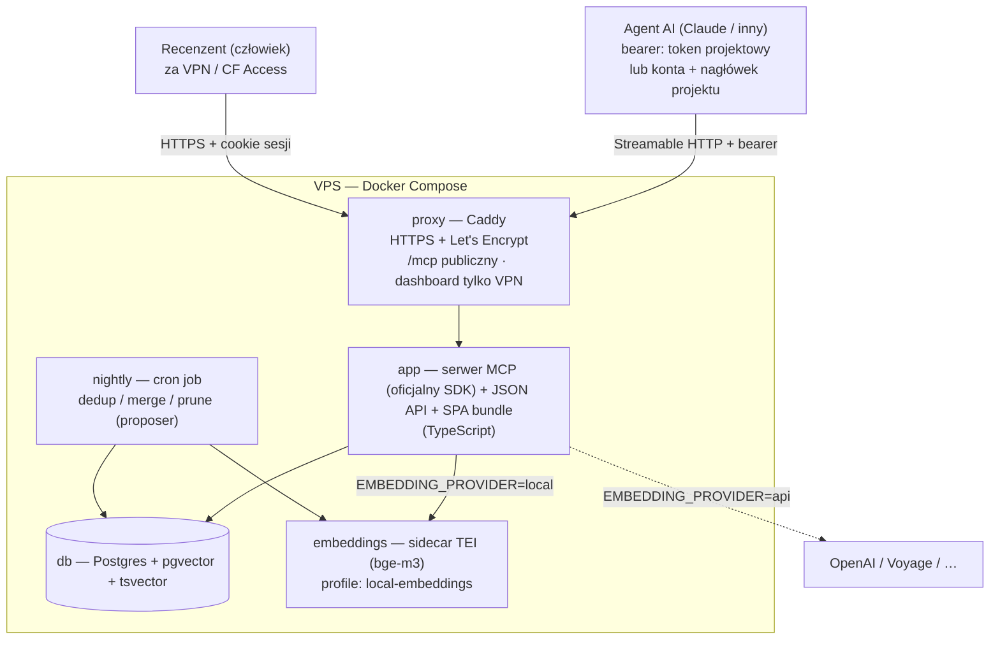

# Context Keeper — Tech Stack & Architektura

**Wersja dokumentu:** v1.5 (wiele repo: token konta, slug projektu, onboarding przez MCP, wyszukiwanie między projektami) · **Data:** 2026-10-06
**Źródła:** `plan-pamiec-agentow-mcp.md`, `research-prior-art-pamiec-agentow.md`, sesja ustaleń przedimplementacyjnych
**Ostatnia synchronizacja z kodem:** 2026-10-06 (synchronizacja kanonu v1.5 — §0, §1, §4, §5, §6, §9, §10, §12, §13, §14, §15)

> Ten dokument opisuje **jak** budujemy. Uzasadnienia produktowe (co i dla kogo) są w [`prd.md`](prd.md).
> Zasada przewodnia: **prosto w v1, schema/architektura gotowa na rozszerzenia.**

---

## 0. Changelog

### v1.5 — wiele repo

1. **Token konta + wybór projektu nagłówkiem** — `project_tokens.project_id IS NULL` = token konta (działa w każdym
   projekcie instancji); projekt wskazuje `X-Context-Keeper-Project: <slug>` z commitowanego `.mcp.json`; nowa kolumna
   `projects.slug`; nierozwiązany projekt = błąd tool-level (`project_*`, koperta `{code, message, details?}`), nie HTTP.
   Migracja 0012. → §4, §5, §10
2. **Onboarding przez MCP** — narzędzia konta `list_projects` / `create_project` (propozycja `proposal_type='create_project'`,
   approve zakłada projekt bez tokena; migracja 0013), prompt `onboard`; bloki `.mcp.json` / `AGENTS.md` / `CLAUDE.md`
   renderuje serwer — jedno źródło dla MCP i dashboardu. → §4, §5, §12, §14
3. **Rate limiting** kluczowany `tokenId:projectId` (narzędzia pamięci) / `tokenId:account` (narzędzia konta), osobny niski
   limit `create_project`. → §10, §12
4. **Wyszukiwanie między projektami** — `search_memory(all_projects)` tylko dla tokenu konta, `get_memory` tokenem konta
   czyta dowolny projekt; `search_events.cross_project` (migracja 0014). → §4, §5, §6, §10
5. **Kontrakt narzędzi** — źródłem tekstu opisów jest kod (`apps/server/src/mcp/tool-contract.ts`);
   [`mcp-tool-contract.md`](mcp-tool-contract.md) to dokument zasad bez kopii opisów. → §5, §14

### v1.3 — dostęp: wiele tokenów per projekt + graceful rotation

1. **`project_tokens` zamiast trzech kolumn tokena na `projects`** — 1 projekt → N tokenów, etykieta
   WYMAGANA przy tworzeniu (atrybucja per-agent), unikalna wśród aktywnych tokenów (partial unique
   index). → §4
2. **Rotacja graceful, token-scoped** (zastępuje hard-cutover v1) — nowy token wydany obok starego,
   stary wchodzi w `grace` i wygasa lazily po `TOKEN_GRACE_PERIOD_HOURS` (bez nocnego sweepu, jedna
   reguła usability dzielona przez auth i dashboard/CLI). `revoke` osobna, natychmiastowa akcja dla
   skompromitowanych danych. → §4, §10, §12
3. **Atrybucja per-agent** — `search_events.token_id` + `audit_log.metadata.{tokenId,tokenLabel}`
   (`actor` pozostaje `agent:<project_id>`, niezmieniony); rate limiting per-`token_id` zamiast
   per-`project_id`. → §4, §10

### v1.2 — domknięcia stacku (framework, embeddingi, proxy, instalator)

1. **Framework hosta wybrany** — NestJS na adapterze Express; DI (provider embeddingów), Guardy (dwie powierzchnie auth), Interceptory (audyt/rate-limit); `nestjs-commander` (CLI), standalone context (nightly). → §2, §9
2. **Presety embeddingów** — trzy zwalidowane profile deploy-time (`multilingual`/`english`/`api`) zamiast surowego knoba modelu; CLI `reembed` dla zmiany presetu. → §7, §9, §12
3. **Reverse proxy opcjonalny** — Caddy w compose profile `edge-proxy`; tryb bring-your-own-proxy (homelab) + `TRUST_PROXY` + rozdzielne porty MCP/dashboard. → §3, §9, §12
4. **Instalator onboardingu** — interaktywny `install.sh` generujący `.env` + sekrety + wybór profili; uruchomienie stacku opcjonalne (prompt tak/nie, default = tylko generacja). → §9

### v1.1 — ustalenia przedimplementacyjne

Uzupełnienia wpięte in-place w sekcje poniżej (sesja domykania planu przed kodem):

1. **Kontrakt z agentem 3-warstwowy** — opisy narzędzi MCP (pełny kontrakt, uniwersalne) + snippet do `CLAUDE.md`/`AGENTS.md` (v1) + plugin (v1.1). → §5, §14
2. **Degradacja embeddingów** — fail-open na obu ścieżkach; twardy budżet czasu na `save`. → §6, §7, §11
3. **Współbieżność kolejki** — optimistic concurrency (base-version stamping) + row-lock w transakcji akceptacji; stale = blokada + badge. → §4, §8bis
4. **Ręczne tworzenie pamięci + przełącznik kontekstu** — human-create (paste + import `.md`); context switcher `Wszystkie`/`Global`/projekt. → §4, [`prd.md`](prd.md) §6.4
5. **Dedup advisory + supersession** — twardy `duplicate_pending` tylko exact-match; „Zatwierdź jako zamiennik [X]"; `conflicts_report` → v2. → §5
6. **Auth klienta MCP zweryfikowany** — statyczny bearer wystarcza (Claude Code potwierdzony); OAuth → roadmapa. → §5, §10
7. **Limity wejścia + walidacja** — per-kind body cap, normalizacja tagów, header. → §4, §5
8. **Sekrety/PII + hard-purge** — skaner (agent=block / human=warn), `secret_blocked` jako sygnał rotacji, purge CLI. → §10
9. **Taksonomia błędów MCP + idempotencja** — isError vs HTTP, `scope→not_found`, hash-idempotencja (`already_exists`). → §5
10. **Semantyka nocnego jobu** — lock, stateless idempotentny re-scan, samosprzątanie stale, harmonogram, ręczny trigger. → §8
11. **Token** — `ck_` + 256-bit, SHA-256 indeksowany (bez pepper), rotacja hard-cutover. → §4, §10
12. **Oficjalny MCP SDK** (`@modelcontextprotocol/sdk`), nie hand-roll. → §2, §5
13. **Strategia testów** — skupiona na rdzeniu poprawności/bezpieczeństwa, bez pełnego pokrycia. → §15

---

## 1. Przegląd architektury

Jeden VPS, Docker Compose, jedna baza (Postgres) jako jedyne źródło prawdy. Serwer MCP i dashboard w jednym procesie `app`. Embeddingi liczone lokalnie (domyślnie) lub przez API — za jednym interfejsem providera.

```mermaid
flowchart TB
    Agent["Agent AI (Claude / inny)\nbearer: token projektowy\nlub konta + nagłówek projektu"]
    Human["Recenzent (człowiek)\nza VPN / CF Access"]

    subgraph VPS["VPS — Docker Compose"]
        Proxy["proxy — Caddy\nHTTPS + Let's Encrypt\n/mcp publiczny · dashboard tylko VPN"]
        App["app — serwer MCP (oficjalny SDK) + JSON API + SPA bundle\n(TypeScript)"]
        DB[("db — Postgres + pgvector + tsvector")]
        Nightly["nightly — cron job\ndedup / merge / prune (proposer)"]
        Emb["embeddings — sidecar TEI (bge-m3)\nprofile: local-embeddings"]
    end

    Agent -->|Streamable HTTP + bearer| Proxy
    Human -->|HTTPS + cookie sesji| Proxy
    Proxy --> App
    App --> DB
    App -->|EMBEDDING_PROVIDER=local| Emb
    App -.->|EMBEDDING_PROVIDER=api| ExternalAPI["OpenAI / Voyage / …"]
    Nightly --> DB
    Nightly --> Emb
```

**Charakterystyka:** app-tier bezstanowy na poziomie logiki (narzędzia MCP są request/response). Ale sidecar modelu (RAM) i rate-limiter w pamięci trzymają stan → **serverless nie jest bliską ścieżką**; skalowanie poziome wymagałoby przeniesienia rate-limitera do współdzielonego store (np. Redis) — poza v1.

**Tryb degradacji (nowe):** provider embeddingów down = stan **degraded, nie unhealthy** — `app` zostaje „up", bo obie ścieżki działają dalej (save tworzy proposal bez embeddingu, search leci FTS-only). Szczegóły w §6/§7/§11.

---

## 2. Stack technologiczny

| Warstwa | Technologia | Uzasadnienie |
|---|---|---|
| **Backend / MCP** | TypeScript + **oficjalny `@modelcontextprotocol/sdk`**, host **NestJS (adapter Express)**, jeden proces | SDK obsługuje protokół i transport Streamable HTTP (POST+GET, initialize, tools/list, tools/call, sesje) i śledzi rewizje spec — nie reimplementujemy zgodności ręcznie. NestJS bo cztery powierzchnie w jednym kodzie: **DI** dla abstrakcji providera embeddingów (§7), **Guardy** dla dwóch rozłącznych auth (`BearerGuard` na `/mcp`, `SessionGuard` na dashboardzie — §10), **Interceptory** dla audytu/rate-limitu, `nestjs-commander` dla CLI i standalone context dla nocnego jobu (reużycie tych samych serwisów co ścieżka akceptacji — §8bis). Adapter **Express** (nie Fastify) — przy tej skali DB+embedding dominują latencję, więc wybieramy najlepiej przetartą kompatybilność transportu SDK. Transport montowany jako controller `/mcp` (`@Post/@Get/@Delete` → `transport.handleRequest`), mapa transportów per-sesja jako singleton-provider. |
| **Baza + wektory + FTS** | Postgres + `pgvector` + wbudowany `tsvector` | Jedna baza, transakcyjnie, bez dedykowanej bazy wektorowej. HNSW ciągnie setki tysięcy wektorów na tej skali. |
| **Embeddingi (local)** | TEI (HuggingFace Text Embeddings Inference), model **bge-m3** (1024 dim, multi-język) — domyślny preset | Treść pamięci mieszana PL/EN; modele EN-only gubią dopasowania po polsku. Alternatywa sidecara: Ollama. **Preset `english` (bge-small-en, 384 dim) jako świadomy wybór deploy-time dla treści EN-only — §7.** |
| **Embeddingi (api)** | OpenAI / Voyage / … za tym samym interfejsem providera | Wybór per deployment (`EMBEDDING_PROVIDER`), nie per-request. |
| **Frontend / dashboard** | SPA React + JSON API | Build SPA = krok w obrazie compose; assety serwuje `app` na tym samym origin. |
| **Reverse proxy** | Caddy (**opcjonalny**, compose profile `edge-proxy`) | Terminacja HTTPS + auto Let's Encrypt; rozdziela ekspozycję (`/mcp` publiczny, dashboard/API tylko VPN/CF Access). Profil off = **bring-your-own-proxy** (istniejący Traefik/nginx/Caddy/CF Tunnel w homelabie); wtedy `TRUST_PROXY` + rozdzielne porty MCP/dashboard (§9). |
| **Deployment** | Pojedynczy VPS + Docker Compose | Najprościej i przewidywalnie w v1; stabilny publiczny endpoint HTTPS wymagany przez remote MCP. |
| **Job** | cron/scheduled kontener `nightly` | Dedup/merge/prune jako proposer. |
| **Migracje** | narzędzie migracyjne od dnia zero | Schema to kilka powiązanych tabel + rozszerzalny enum `kind`. |
| **Testy** | unit + integration na efemerycznym Postgresie (testcontainers) + `recall@k` + cienki MCP e2e | Skupione na rdzeniu poprawności/bezpieczeństwa, nie pełne pokrycie (§15). |

---

## 3. Serwisy Docker Compose

| Serwis | Rola |
|---|---|
| `proxy` | Caddy — HTTPS, routing, rozdział ekspozycji publiczny/VPN. **Opcjonalny (compose profile `edge-proxy`);** off = bring-your-own-proxy (§9). |
| `db` | Postgres + `pgvector`. |
| `app` | Serwer MCP (Streamable HTTP przez oficjalny SDK, bearer) + JSON API dashboardu (sesja) + statyczny bundle SPA — trzy powierzchnie, jeden origin. |
| `nightly` | Cron job dedup/merge/prune (proposer). |
| `embeddings` | **Opcjonalny** sidecar modelu lokalnego (TEI/bge-m3). W **compose profile** `local-embeddings` — startuje tylko przy `EMBEDDING_PROVIDER=local`; przy `api` się nie podnosi. |

---

## 4. Model danych

Jeden dyskryminator `kind` na tabeli `memories` (nie osobne tabele — reużycie `embeddings`/`proposals`/`revisions`, jedna ścieżka retrievalu i chunkingu). `kind` opisuje czym pamięć **jest**; autorstwo trzyma osobne pole `source`.

### `memories` (dokument kanoniczny)

| pole | opis |
|---|---|
| `id` | krótki, opaque, URL-safe (nanoid, np. `mem_a1b2c3`); stabilny — to dostaje agent w search i podaje do get |
| `header` | krótki tytuł/streszczenie; to zwraca search. **Limit ~200 znaków, jednolinijkowy** (strip newline) |
| `body` | pełna treść (markdown). **Limit per `kind`:** `fact` ~8 KB (~2k tok.), `document` ~256 KB (§5) |
| `kind` | `fact` \| `document` \| `event` (rozszerzalny enum; `event` zaimplementowane w v1.2) |
| `tags` | lista stringów. **Normalizacja:** trim + lowercase + collapse whitespace; max ~10, każdy ≤ ~40 zn., charset `[a-z0-9-_/]` |
| `scope` | `global` \| `project` |
| `project_id` | z credentialu (token projektowy) albo z nagłówka `X-Context-Keeper-Project` (token konta, v1.5) przy zapisie agenta; z aktywnego kontekstu UI (human-create); pusty dla `global` |
| `status` | `approved` \| `archived` (soft-delete, nigdy hard-delete) \| `purged` (tombstone po hard-purge §10 — treść wymazana, wiersz zostaje; ustawiane wyłącznie przez CLI/dashboard purge). **Predykat „wszystko poza `approved`" jest niepoprawny** — `purged` to nie archiwum |
| `source` | `agent` \| `human` \| `nightly` (kto utworzył) |
| `created_at` / `updated_at` / `approved_at` | znaczniki czasu |
| `last_accessed_at` / `access_count` | feed dla prune; zbierane od dnia zero, nie do odtworzenia wstecz |
| `event_time` | (v1.2) **wyłącznie `kind=event`** — nullable, backdatable znacznik KIEDY zdarzenie się wydarzyło (osobny od `created_at` = kiedy wpis powstał w pamięci). Ustawiany przy tworzeniu, **korygowalny po fakcie** (v1.2, formularz edycji w przeglądarce pamięci — human-only). Napędza sortowanie ekranu „Oś czasu" i age-decay w rankingu retrievalu. |

- `fact` = fakty accreted przez agenta (mutowalne, podlegają dedup/supersession/prune).
- `document` = dokumenty authored przez człowieka (PRD, roadmap) — kanon, permanentne, poza zasięgiem nocnego joba. Od v1.2 agent może *zaproponować* nowy `document` przez `save_memory` (`kind='document'`, human-gated jak każdy proposal); **edycja istniejącego dokumentu przez agenta pozostaje poza zakresem** (agent-update → osobne zadanie roadmapy).
- `event` = zdarzenia ze stemplem czasu (v1.2) — tworzone przez człowieka w dashboardzie **oraz przez agenta** (v1.3: `save_memory` przyjmuje `kind='event'` z **wymaganym** `event_time`, backdate nieograniczony, daty przyszłe dozwolone — ta sama `validateEventTime` co formularz human-create; `supersedes` na evencie pozostaje zakazany, korekta jest human-only). W rankingu retrievalu podlegają age-decay (wykładniczy half-life, `EVENT_DECAY_HALFLIFE_DAYS`, aplikowany post-RRF, zero wpływu na fact/document). Domyślnie **wyłączone** z domyślnego `kind` w `search_memory` — per-projektowy boolean `projects.include_events_in_default_search` (dialog szczegółów projektu, §9.3) je włącza; `kind=event` jawny w zapytaniu działa zawsze niezależnie od togglea.
- Model 2D: `scope` × `kind` (`document` może być `global` = glossary/standard, lub `project` = PRD tego projektu).

### `embeddings` (jeden-do-wielu — chunking)

`memory_id`, `chunk_index`, `chunk_text`, `embedding_model`, `vector`. Mały dokument = jeden chunk (chunking wtedy niewidoczny). Jedna ścieżka kodu dla małych i dużych.

### `proposals` (kolejka akceptacji — każda treściowa mutacja + propozycje projektów)

`type` (`create`\|`update`\|`merge`\|`delete`\|`create_project`), `payload`, `affected_ids`, `origin` (`agent`\|`human`\|`nightly`), `status` (`pending`\|`approved`\|`rejected`\|`withdrawn`). `withdrawn` = samo-wycofanie maszynowe przez nocny job (§8), odróżnione od `rejected` (decyzja człowieka) mimo tego samego skutku — audyt ma pokazywać KTO zdecydował. Metryka „decyzje recenzenta" liczy `approved`+`rejected`, nigdy `withdrawn`.

- Kolejka to **tabela**, nie flaga `status=pending` na dokumencie — bo merge (A+B→C) to operacja „utwórz C, zarchiwizuj A, zarchiwizuj B", której flaga nie wyrazi. Jeden mechanizm i jedna powierzchnia audytu dla zapisów agenta, edycji człowieka i propozycji nocnego joba.
- **Optimistic concurrency (nowe):** proposal celujący w istniejące pamięci zapisuje przy utworzeniu **`base_versions`** — `revision_id` bazowy każdego `affected_id` (stan, względem którego liczono payload). Przy akceptacji sprawdzany wewnątrz transakcji (§8bis). Drift → proposal jest **stale** (computed guard, bez nowej wartości w enumie `status`).
- **Idempotencja / dedup (nowe):** twardy `duplicate_pending` tylko przy **exact match** `hash(header+body+scope+project+kind [+event_time])` wobec pending proposala — szóste pole dokładane WYŁĄCZNIE dla `kind='event'` (hashe `fact`/`document` bit-w-bit jak przed v1.3), więc to samo zdarzenie odnotowane dla dwóch różnych czasów to dwie pamięci, nie duplikat; exact-match do approved → `already_exists`; podobne → proposal + hint (§5).
- **`similar_memories` (v1.6, A1; `jsonb`, nullable)** — wynik detekcji prawie-duplikatów liczony **raz, przy `save_memory`**; trzy stany: `NULL` = nie policzono (provider down / przekroczony budżet czasu / propozycja bez detekcji), `[]` = policzono, brak podobnych, lista = ≤3 pozycje `{id, distance}` rosnąco po odległości kosinusowej (id zatwierdzonej pamięci). Wypełniana tylko dla `origin='agent'` + `type='create'` + `kind` fact/document; `update` (`supersedes`), `event`, propozycje nocnego joba i `create_project` zawsze mają `NULL`. Edit-before-approve jej **nie zmienia** (opisuje oryginał agenta); brak backfillu — propozycje sprzed migracji 0016 zostają `NULL`. Zapis idzie UPDATE-em po insercie proposala (proposal powstaje przed jakimkolwiek wywołaniem providera). Serwer rozwiązuje id przy odczycie (`GET /api/proposals/:id` → `available`/`header`/`scope`; zarchiwizowana lub usunięta pamięć = niedostępna, UI ją pomija), a lekka lista (`GET /api/proposals`) niesie tylko flagę `hasSimilar`.
- **`create_project` (v1.5)** — propozycja założenia projektu, nie mutacja pamięci: payload `{name, slug}`, `scope='global'`, `project_id=NULL`, `affected_ids=[]`, `content_hash=NULL`. Unikalność slugu wśród oczekujących: partial unique index `proposals_create_project_slug_pending_key` na `(payload->>'slug') WHERE status='pending' AND payload->>'slug' IS NOT NULL` (predykat celowo bez `type = 'create_project'` — Postgres 55P04 przy migracji w jednej transakcji; niezmiennik: tylko ten payload ma klucz `slug`). Approve zakłada wiersz `projects` **bez tokena** (zniesiony niezmiennik „nigdy projekt bez tokena"); kolizja slugu przy approve → `validation_error`, propozycja zostaje `pending`; odrzucenie zwalnia slug. Brak edit-before-approve i supersession.

> **Forward-compat (v2):** miejsce na pole `confidence`/`auto_eligible` (anti-fatigue / sedymentacja).

### `revisions`

Lekkie snapshoty przy każdej zatwierdzonej zmianie (żeby widzieć „co tu było wcześniej", zwłaszcza po przepisaniu przez nocny job). Strategia: pełny snapshot dla `fact` (małe, tanie); dla dużych `document` rozważyć snapshot różnicowy (diff) — knob. **Supersession** (zamiennik pamięci przez człowieka) linkowany w `revisions` — patrz „Zatwierdź jako zamiennik" (§5).

### `memory_relations` (v1.2 — zaimplementowane)

Typowane krawędzie między pamięciami: `from_id`, `to_id`, `type` (`caused_by` \| `follows` \| `context_for` — enum **świadomie zamknięty**, dokładnie 3 wartości, trzymany w sync z zod-enumem `relations[].type` w `save_memory`). Tworzone przez człowieka (dashboard) i przez agenta (`relations` w `save_memory`, materializowane przy akceptacji proposala). Każde utworzenie/usunięcie ma wpis audytu (`relation_created` / `relation_removed`); archiwizacja i merge kaskadowo kasują krawędzie, audytując każdą z osobna. Napędzają **1-hop graph boost** w rankingu (§6, re-rank only).

### `staging_embeddings`

Wektory policzone przy `save` (dla dedup), zanim proposal zostanie zatwierdzony. Ta sama struktura co `embeddings`, kluczowane `proposal_id`. Przy akceptacji przenoszone do `embeddings`; przy odrzuceniu/edycji — kasowane/liczone od nowa. **Może być puste** (embedding provider down przy save, §7) → autorytatywny embedding liczony przy akceptacji.

### `audit_log` (append-only)

`id`, `event_type`, `actor` (`agent:<project_id>` (narzędzia pamięci — projekt z credentialu albo z nagłówka), `agent:account` (v1.5 — akcje tokenu konta bez projektu: `create_project` → `proposal_created` / `secret_blocked`, token w `metadata.{tokenId,tokenLabel}`) albo `"human-dashboard"`), `affected_ids`, `revision_id` (opcjonalnie, before/after), `created_at`. Odczyty **nie** logowane per-event — zostają liczniki.

- **event_type:** `proposal_created`/`approved`/`rejected`/`edited`, `human_edit`, `archive`, `promote`, `token_created`/`rotated`/**`revoked`**/**`relabeled`** (v1.3 — `revoked`=unieważnienie natychmiastowe, `relabeled`=rename etykiety, kosmetyczny), **`secret_blocked`** (metadane: typ sekretu + `tokenId`/`tokenLabel` (v1.3, atrybucja per-agent) + czas — bez materiału sekretu; sygnał rotacji/unieważnienia, §10), **`purge_tombstone`** (content wymazany, powód, czas — §10), **`nightly_run`** (status/liczniki, §8), **`project_settings_changed`** (v1.2 — zmiana ustawień projektu z dialogu szczegółów, np. `include_events_in_default_search`; metadane `{field, from, to}`; v1.5: także `field: 'slug'` przy edycji slugu, `{from, to}`), **`llm_secret_skipped`** (v1.6 — krok LLM nocnego joba pominął wpis pamięci, bo skaner sekretów trafił w jego treść; `affected_ids` = id pamięci, metadane `{secretType, purpose}`, bez materiału; osobny typ, nie `secret_blocked`, żeby nie zawyżać metryki `secretBlocked24h` i nie niosić CTA tokena, §8), **`instance_settings_changed`** (v1.6 — zapis w ekranie Ustawienia; metadane `{section: 'llm', changes}`, klucz API wyłącznie jako `set`/`cleared`, nigdy wartość; pomijany, gdy nic się nie zmieniło). v1.5 nie dodało wartości enuma `event_type`; v1.6 dodaje dwie (migracja 0017).

### `projects`

Projekty. Dodanie projektu bez redeployu.

- `include_events_in_default_search` (v1.2) — boolean, default `false`. Per-projektowy toggle: czy `kind=event` dokłada się do domyślnego zestawu `kind` w `search_memory` (agent nadal może zawsze poprosić o `kind=event` jawnie). Edytowany w dialogu szczegółów projektu (§9.3); zmiana audytowana jako `project_settings_changed`.
- `slug` (v1.5) — `text NOT NULL`, format `^[a-z0-9]+(-[a-z0-9]+)*$`, 2–48 znaków, unikalny (`projects_slug_key` + CHECK `projects_slug_format_check`); wartość nagłówka `X-Context-Keeper-Project`. Backfill w migracji 0012 z `name`: transliteracja (polskie + łacińskie diakrytyki), lowercase, ciągi spoza `[a-z0-9]` → `-`, cięcie do 48, wynik < 2 zn. → `project-<końcówka id>`, kolizje → `-2`, `-3`… (kolejność `created_at, id`); reguły zduplikowane w `projects/slug.ts` z testem parytetu. Edytowalny w dashboardzie (ostrzeżenie + audyt `project_settings_changed`), **bez aliasów** — repo ze starym slugiem dostają `project_not_found`. CLI `create-project --slug`.

### `project_tokens` (v1.3 — wiele tokenów per projekt + graceful rotation; v1.5 — tokeny konta)

1 projekt → N tokenów (dawniej trzy kolumny tokena bezpośrednio na `projects` — 1:1). **Token: `ck_` +
256-bit losowość (base64url); w bazie `token_hash` = SHA-256 (deterministyczny, indeksowany), bez
pepper.** Lookup token→(projekt, token) = jeden trafiony indeks JOIN (§10).

- `label` — **WYMAGANA** przy tworzeniu (atrybucja per-agent — który token zapisał/wyszukał), unikalna
  per projekt **wśród aktywnych** tokenów (partial unique index `(project_id, label) WHERE
  status='active'` — jedyna scoping, która przeżywa rotację: kopia w `grace` niesie tę samą etykietę
  co jej zamiennik). Rename po utworzeniu wystawiony (`PATCH`, kosmetyczny, nie dotyka usability).
- `status` — `active` / `grace` / `revoked` (enum `project_token_state`). **`expired` NIE jest
  persystowany** — pochodna `grace` + `expires_at <= now()`, liczona lazily przy KAŻDYM auth lookupie
  i przy renderze dashboardu/CLI z jednej reguły (`effectiveTokenStatus`, dzielona z SQL-owym
  predykatem usability) — bez nocnego sweepu, więc bez okna, w którym wygasły token wciąż
  autentykuje.
- **Rotacja jest TOKEN-scoped, nie project-scoped:** `rotateToken(tokenId)` przenosi JEDEN token do
  `grace` (`expires_at = now() + TOKEN_GRACE_PERIOD_HOURS`, domyślnie 72h) i mintuje zamiennik z tą
  samą etykietą — pozostałe tokeny projektu (inni agenci) nietknięte. `revokeToken(tokenId)` jest
  osobna, natychmiastowa akcja (dla skompromitowanych danych) — działa na `active` i `grace`,
  idempotentna.
- `search_events.token_id` (nullable, `ON DELETE SET NULL`) + `audit_log.metadata.{tokenId,tokenLabel}`
  niosą atrybucję per-agent — `audit_log.actor` pozostaje `agent:<project_id>` (dla tokenu konta to
  projekt z nagłówka; `agent:account` dla akcji bez projektu — format aktora niezmieniony, żeby nie
  złamać filtra `AuditService.query` po projekcie).
- Rate limiting (§10) kluczowany `tokenId:projectId` (v1.5; v1.3: `token_id`) — N agentów per projekt =
  N budżetów, a token konta ma osobny budżet w każdym projekcie.
- **Token konta (v1.5):** `project_id IS NULL` (FK z cascade zostaje dla tokenów projektowych; migracja
  0012 operacyjnie nieodwracalna po pierwszym tokenie konta). Ten sam cykl życia
  (`active`/`grace`/`revoked`). Unikalność etykiety tokenów konta: osobny partial unique
  `project_tokens_account_label_active_key` na `(label) WHERE project_id IS NULL AND status='active'`
  (NULL-e są w indeksie projektowym rozłączne). Lookup nie zakłada projektu: guard ustala `tokenScope` i
  rozwiązuje projekt z nagłówka.

### `llm_settings` (v1.6 — ustawienia kroku LLM nocnego joba)

Konfiguracja opcjonalnego kroku LLM (§8) żyje **w bazie i w dashboardzie** (ekran Ustawienia), nie w env — zmiana działa od
następnego przebiegu bez redeployu. Kolumny: `id` (`text` PK; wiersz instancji ma stałe `'global'`, przyszłe wiersze per projekt `llms_…`),
`project_id` (nullable, FK `projects` ON DELETE CASCADE; **`NULL` = ustawienie instancji**), `enabled` (default `false`), `endpoint`
(pełny URL `…/chat/completions`), `model` (**bez wartości domyślnej** — nazwa zależy od providera), `api_key_ciphertext`
(szyfrogram, §10), `call_cap` (default 100, CHECK 1–10000), `timeout_ms` (default 30000, CHECK 1000–300000), `scan_window_days` (default 1, CHECK 1–365; migracja 0018 — okno przeglądu detektorów LLM po `memories.created_at`, wspólne dla B2/B3), `updated_at`.
`UNIQUE NULLS NOT DISTINCT (project_id)` — najwyżej jeden wiersz instancji i jeden na projekt; CHECK `NOT enabled OR (endpoint IS NOT NULL AND
model IS NOT NULL)` — niekompletna konfiguracja nie zapisze się jako włączona. Migracja 0017 zasiewa wiersz instancji
(`id = 'global'`, wyłączony); odczyty mają fallback na wartości domyślne, gdyby go zabrakło. **Per projekt** (poza zakresem v1.6): dodatkowy
wiersz z `project_id` = PEŁNE nadpisanie, nie łatka pól — schemat już to dopuszcza.

### `search_events` (instrumentacja `search_memory`, v1.1; `cross_project` v1.5)

Append-only, jeden wiersz per wywołanie `search_memory` (wyłącznie MCP; `get_memory` nie jest
instrumentowany — ma `access_count`). Kolumny: `id` (`sev_…`), `project_id` (NOT NULL, FK `restrict` —
bieżący projekt), `token_id` (nullable, `ON DELETE SET NULL`, v1.3), `result_count`, `degraded` (brak
query-vectora), `cross_project` (v1.5 — wyszukiwanie z `all_projects: true`, zapisywane pod bieżącym
projektem i tokenem), `created_at`. Bez treści i hasha zapytania (prywatność). Retencja
`SEARCH_EVENTS_RETENTION_DAYS` (nocny job). Osobna tabela od `audit_log`. **Reguła zero-result:** wskaźnik
zero-result na ekranie Pomiary wyłącza wiersze `degraded` ORAZ `cross_project` (licznik i mianownik) —
degradacja nie znaczy „brak treści", a tryb cross rzadziej daje 0; w liczbie wyszukiwań i wolumenie liczą
się normalnie. Wywołanie odrzucone przed wyszukiwaniem (błąd scope'u, `all_projects` tokenem projektowym)
nie zostawia wiersza.

### Ścieżka human-create (nowe)

`source=human` → **commit bezpośredni + revision, z pominięciem kolejki** (FR-Q4). Reużywa tej samej logiki materializacji co akceptacja proposala (chunking + embed + insert `memories` approved + `embeddings` + `revision` + `audit`), tylko prosto do `embeddings` (bez staging). Embedding z tym samym fail-open + budżetem czasu (§7).

### Forward-compat (v2, miejsce w schemie już teraz)

- Tabela `outcome` (analogicznie do `embeddings`/`revisions`) — dla Memory Worth (`report_outcome`).
- ~~Tabela relacji~~ — **zaimplementowana w v1.2**, przestała być forward-compat: patrz
  `memory_relations` wyżej w §4 i krok 6 pipeline'u w §6.
- Pole `confidence`/`auto_eligible` w `proposals` — anti-fatigue.

---

## 5. Interfejs MCP

- **Transport: Streamable HTTP** przez **oficjalny `@modelcontextprotocol/sdk`**, jeden endpoint (POST+GET). Stary HTTP+SSE przestarzały (spec 2025-03-26); najnowsza rewizja transportu 2025-11-25 — SDK ją śledzi. Narzędzia request/response → app-tier bezstanowy.
- **Auth: statyczny bearer** w `Authorization` — token projektowy (→ jego projekt) albo **token konta** (v1.5, → projekt z nagłówka `X-Context-Keeper-Project: <slug>` z commitowanego `.mcp.json`). Nierozwiązany projekt nie odrzuca żądania (każdy ważny token przechodzi); narzędzie pamięci zwraca błąd tool-level `project_*` — przy HTTP 4xx klient MCP uznałby serwer za niepodłączony. **Zweryfikowane (nowe):** Claude Code CLI łączy się po `--header "Authorization: Bearer …"`; `.mcp.json` = `type:"http"` (alias `streamable-http`), `url`, `headers`; wspierana ekspansja `${VAR}` (token w env, nie plaintext w commicie); serwer odrzucający header → deterministyczny fail (bez cichego fallbacku do OAuth). **OAuth 2.1 + PKCE → roadmapa** (gdyby serwer stał się publiczny / potrzebny Desktop/web-connector); kod bearer się nie marnuje.

### Narzędzia

| Narzędzie | Sygnatura | Uwagi |
|---|---|---|
| `search_memory` | `(query, tags?, kind?, all_projects?)` → `[{id, header, tags, score, excerpt?, project?}]` | Scope: projekt (z tokena albo nagłówka) + `global`. (v1.5) `all_projects: true` — tylko token konta: global + wszystkie projekty, wynik niesie `project` (slug \| `null`), token projektowy → `validation_error` (§6). Domyślnie `fact`+`document` (+ `event`, v1.2, TYLKO gdy projekt ma `include_events_in_default_search=true`); opcjonalny filtr `kind` (`fact`\|`document`\|`event`) honorowany zawsze niezależnie od togglea. Dla `document` dokłada excerpt dopasowanego chunku; dla `event` ranking podlega age-decay (§4). Przy embedding-down → **FTS-only** (§6), ciche. |
| `get_memory` | `(id)` → pełne body | Bumpuje `last_accessed_at`/`access_count`. **Scope zależny od typu tokena:** projektowy — projekt tokena albo `global`, poza scope lub nieistniejące → identyczne `not_found` (anty-probing IDOR); konta (v1.5) — dowolny projekt instancji + `global`. |
| `save_memory` | `(header, body, tags?, kind?, event_time?, supersedes?, relations?)` → `{id, status}` | Liczy embedding + dedup przed odpowiedzią z **twardym budżetem czasu** (po timeoucie → `pending` bez embeddingu, doembed przy akceptacji). `id` mintowany przy proposalu; wiersz `memories` materializowany dopiero przy akceptacji. Statusy: `pending` / `duplicate_pending` / `already_exists`. Pełny kontrakt parametrów i guardów → tekst opisu w `apps/server/src/mcp/tool-contract.ts` (`SAVE_MEMORY_DESCRIPTION`), zasady w [`mcp-tool-contract.md`](mcp-tool-contract.md). |
| `list_projects` | `()` → `{projects:[{slug,name,mcpJson}], agentsMd, claudeMd, mcpUrlConfigured, hint}` | (v1.5) tylko token konta (zawsze, z nagłówkiem i bez); read-only; nigdy nie zwraca tokena. |
| `create_project` | `(name, slug)` → `{status:'pending', proposalId, project, mcpJson, agentsMd, claudeMd, mcpUrlConfigured, next}` | (v1.5) tylko token konta; propozycja w kolejce (human-gated); approve zakłada projekt bez tokena. |

**Prompt `onboard`** (v1.5) — tylko token konta (capability `prompts`), statyczny, bez argumentów, bez dostępu do bazy; nic load-bearing (§14). Zestaw narzędzi i prompt zależą wyłącznie od typu tokena (`mcp-server.factory.ts`), nigdy od nagłówka ani stanu bazy.

### Dedup / idempotencja (advisory, nie hard-block)

Embedding-similarity **nie odróżnia** korekty od duplikatu („PG15"→„PG16", negacja) → auto-suppression po podobieństwie jest niebezpieczne (jego failure mode to korekty). Dlatego:

- exact `hash(header+body+scope+project+kind [+event_time dla `kind='event'`])` == pending proposal → **`duplicate_pending`** (id proposala; łapie retry sieciowy),
- exact == approved memory → **`already_exists`** (id pamięci),
- **podobne-ale-nie-exact → proposal ZAWSZE powstaje** + hint „similar to [ids]" dla recenzenta (reguła niżej),
- nowe → create.

**Hint „podobne do istniejących" (v1.6, A1)** — liczony przy `save_memory` (create agenta), zapisany w `proposals.similar_memories` (§4):

- **Próg:** `NEAR_DUPLICATE_DISTANCE` — dystans kosinusowy `<=>`, pozycja trafia do hintu przy odległości ≤ progu. Domyślnie **0.20**, zmierzone dla bge-m3 (domyślny preset `multilingual`, 2026-10-07, korpus dogfood): łapie 86% parafraz (36/42), 0% niepowiązanych próbek (najbliższa niepowiązana 0.311); korekty wpadają w 89% (zamierzone — recenzent rozważa „Zatwierdź jako zamiennik"). Wartość jest **specyficzna dla modelu**: preset `api` z text-embedding-3-small (żywa instancja dogfood) **musi** ustawić jawnie `NEAR_DUPLICATE_DISTANCE=0.13` w env (Coolify) — przy 0.13 łapie 79% parafraz PL→PL (23/29) i nie daje fałszywych alarmów w tle (kolejne różne pary od 0.138); parafrazy między językami (EN↔PL, dystans 0.26–0.34) nakładają się na różne fakty, więc żaden próg ich nie złapie (ograniczenie modelu, patrz backlog). Niezależny od `NIGHTLY_DEDUP_DISTANCE` — nocny próg jest celowo wąski („scal wąsko"), hint ma łapać parafrazy; ten sam próg ma później zasilać bezpiecznik auto mode (A2).
- **Zakres porównania:** wyłącznie zatwierdzone pamięci (`status='approved'`; pending proposale nie wchodzą), z projektu zapisu **i** `global`, tego samego `kind` (fact/document; `event` bez detekcji), z wektorami aktywnego modelu. Przez wspólny prymityw ANN (`findAnnNeighbors`), nie osobne zapytanie.
- **Dokument:** minimum odległości po parach chunków, kolaps do jednej pozycji na pamięć; najwyżej 3 pozycje, od najbliższej.
- **Budżet:** wyszukanie mieści się w **tym samym** twardym budżecie `EMBEDDING_SAVE_TIMEOUT_MS` co embedding (jeden deadline na oba kroki); przekroczenie (lub brak wektora) → `NULL`, `save_memory` i tak zwraca `pending`. Bardzo duży dokument (wiele chunków) może więc skończyć jako `NULL`.
- **Advisory, nie dla agenta:** nic nie jest suppresowane ani odrzucane po podobieństwie; kontrakt `{id, status}` i opis narzędzia MCP bez zmian — agent hintu nie dostaje.
- **Nocny krok dedup** (§8) działa osobną polityką (ścisła partycja, `NIGHTLY_DEDUP_DISTANCE`) i jest bez zmian.

Bez client-supplied idempotency key w v1 (hash treści wystarcza).

### Taksonomia błędów

Błędy *wykonania narzędzia* → wynik z **`isError: true`** + koperta `{code, message, details?}` (agent czyta i się adaptuje). Błędy *transportu/auth* → **status HTTP** (obsługuje klient).

| Warstwa | Przypadek | `code` / status |
|---|---|---|
| Tool-level (`isError`) | walidacja poza limitem / braki | `validation_error` |
| | sekret wykryty przy save | `secret_blocked` (agent; „usuń sekret, referuj po nazwie") |
| | narzędzie pamięci, token konta bez nagłówka `X-Context-Keeper-Project` | `project_required` + `details.projects` (`[{slug, name}]`, wszystkie projekty) |
| | narzędzie pamięci, token konta, slug z nagłówka nie istnieje albo ma zły format | `project_not_found` + `details.projects` |
| | narzędzie pamięci, token konta, slug należy do oczekującej propozycji `create_project` | `project_pending` (bez `details`) |
| | narzędzie pamięci, token projektowy + nagłówek z innym slugiem niż projekt tokena | `project_forbidden` (bez `details`, stały komunikat bez echa slugu — anty-probing) |
| | `search_memory` z `all_projects: true` tokenem projektowym | `validation_error` |
| | `get_memory` — token projektowy: poza scope (projekt + `global`) lub nieistniejące; token konta: nieistniejące / niezatwierdzone (odczyt dowolnego projektu jest dozwolony) | `not_found` (nieodróżnialne — anty-probing) |
| | `create_project` — slug w złym formacie, projekt o tym slugu już istnieje, propozycja tego slugu już oczekuje, nazwa pusta po normalizacji | `validation_error` |
| | `create_project` — nazwa wygląda jak sekret | `secret_blocked` |
| Transport (HTTP) | zły/brak/nieusable bearer (projektowy lub konta — ten sam komunikat) | `401` |
| | rate limit — per token × projekt × narzędzie (klucz `tokenId:projectId`); narzędzia konta per token (`tokenId:account`), `create_project` z własnym niskim limitem; przed auth throttle per IP | `429` + `Retry-After` |
| Nie-błąd (status w wyniku) | save | `pending` / `duplicate_pending` / `already_exists` |
| | search przy embedding-down | ciche FTS-only |

Błędy scope'u projektu sprawdzane są na początku handlera narzędzia (`requireProject()`) — przed naszą walidacją (`validation_error`) i logiką narzędzia, bez skutków ubocznych (audyt, `search_events`) i bez zużycia budżetu rate limitu. Wcześniej działa tylko walidacja `inputSchema` w SDK MCP: argumenty niezgodne ze schematem dają surowy błąd SDK (`isError` bez koperty `{code}`).

`code` stabilne (snippet/plugin i agenci mogą się na nich opierać); komunikaty tekstowe mogą się zmieniać. `details` występuje tylko przy `project_required`/`project_not_found` (`toErrorEnvelope`, `common/errors.ts`) i ma stały kształt.

### Semantyka zapisu

- **Async ack — fire-and-forget.** Agent nie czeka, nie pollinguje; gate decyduje tylko o widoczności dla przyszłych sesji.
- **Zapisy agenta: tylko project-scoped.** Promocja do `global` = akcja człowieka.
- **Agent tworzy i koryguje (v1.2+).** `save_memory` z `supersedes: <id>` produkuje proposal `type='update'` — in-place korektę własnej pamięci zamiast luźnego duplikatu; bez `supersedes` to zwykły `create`. Human-mediated supersession („Zatwierdź jako zamiennik [X]" w dashboardzie) zostaje jako ścieżka równoległa. Wyjątek: `supersedes` na `kind='event'` jest zakazane (wczesny guard) — korekta zdarzenia, w tym `event_time`, pozostaje human-only.
- **Ścieżka `update` ma producenta agentowego** — każdy nowy guard, metryka czy filtr kolejki musi ją uwzględniać, nie tylko `create`.

---

## 6. Retrieval pipeline

1. **Embed query** tym samym providerem co zapisy (przy `api` = koszt + egress treści query per search). **Przy embedding-down → pomijamy ramię wektorowe, lecimy FTS-only** (RRF na jednej liście); zwracamy wyniki (dokładne tokeny techniczne działają), log + metryka, bez sygnału do agenta.
2. **Wektor** na chunkach (`pgvector`, HNSW) — semantyka, synonimy, fleksja PL/EN. **Collapse**: trafienia chunków grupowane po `memory_id`, najlepszy score na dokument.
3. **FTS** na całym dokumencie (`tsvector`, konfiguracja **`simple`** — bez stemmingu, żeby nie masakrować mieszanki PL/EN; fleksję/semantykę bierze wektor bge-m3, FTS zostaje przy dokładnym trafieniu tokenu technicznego).
4. **Fuzja RRF** (Reciprocal Rank Fusion) list *dokumentów* — bez tuningu wag, stała `k` (typowo 60).
5. **Filtr aktywnego modelu:** `WHERE embedding_model = <aktywny>` (podczas re-embedu modele współistnieją, przestrzenie nieporównywalne).
6. **Post-fuzja: age-decay × graph boost** (oba re-rank only, mnożniki na score z RRF — nie zmieniają zbioru kandydatów, tylko kolejność). **Age-decay:** wykładniczy half-life `EVENT_DECAY_HALFLIFE_DAYS`, wyłącznie `kind='event'`, ujemny wiek (data przyszła) clampowany do faktora 1. **Graph boost:** jedno dodatkowe zapytanie o krawędzie `memory_relations` w obrębie zbioru wyników, waga `GRAPH_BOOST_WEIGHT` (0 = wyłączony). To jedyne miejsce, gdzie kolejność operacji rankingu jest udokumentowana — debugując „dlaczego ten wynik wyszedł wyżej", zacznij tutaj.
7. **Top-k + próg relevance** (odcięcie szumu).
8. **Dwufazowo:** `search_memory` → nagłówki (+ excerpt dla `document`); `get_memory(id)` → pełne body (v1 = całość). Chunk-targeted `get` → v2.

> **Tryb cross-project (v1.5, `all_projects: true`, tylko token konta):** warunek zakresu (`memory/read-scope.ts`) budowany raz i podawany obu ramionom (FTS i wektor) — global + każdy projekt w jednej puli RRF, te same limity kandydatów i top-k, **bez preferencji bieżącego projektu**. Domyślny zestaw `kind` z togglea **bieżącego** projektu. Graph boost (krok 6) bierze krawędzie każdego projektu obecnego w zbiorze wyników (krawędzie są intra-project — brak boostu między projektami). Wyniki niosą `project` (slug lub `null`); w trybie domyślnym pola nie ma. Jeden wiersz `search_events` z `cross_project=true` (§4).

**Tagi:** podwójna rola — filtr strukturalny w search + tekst dopisany do embeddowanego chunku.

**Eval (v1-light):** mały labelowany zestaw `zapytanie → oczekiwane memory_id` + skrypt `recall@k` jako smoke-test regresji przy zmianach chunkingu/progów/modelu.

**Bezpieczeństwo retrievalu:** świadomość ataku rank-0 injection w fuzji hybrydowej (przebadane na RRF/MAX/weighted). Bramka akceptacji jest tu przewagą — zatruta pamięć musi przejść approve, zanim wpłynie na wyniki.

---

## 7. Embeddingi — abstrakcja providera

- **Jeden interfejs providera, dwie implementacje.** `local` → sidecar TEI w sieci compose; `api` → OpenAI/Voyage/…. `EMBEDDING_PROVIDER` w env przełącza; **jedna ścieżka kodu** w retrievalu.
- **Wybór per deployment, `local` domyślny.** Nie per-request: różne modele = różny wymiar i nieporównywalna przestrzeń. Zmiana modelu = `ALTER` kolumny `vector` (stały wymiar) + re-embed wszystkiego + rebuild HNSW. „Wspierane" = kod obu ścieżek gotowy, **nie** tani runtime-swap.
- Schema zapisuje `embedding_model` przy każdym wektorze od dnia zero → gotowość na hot-swap z re-embedem w przyszłości.
- **Domyślny model lokalny: bge-m3** (multi-język, 1024 dim, ~2–4 GB RAM). GPU niepotrzebne przy tej skali (embedowanie tylko przy zapisach i zapytaniach).

### Presety embeddingów (wybór deploy-time)

Trzy zwalidowane presety zamiast surowego knoba `EMBEDDING_MODEL` — każdy spina `EMBEDDING_PROVIDER`+`EMBEDDING_MODEL`+`EMBEDDING_DIM` spójnie (autorytatywne pozostają te trzy zmienne; preset to wygoda instalatora, który je wypisuje), żeby operator nie rozjechał wymiaru z kolumną `vector`:

| Preset | Provider | Model | Dim | VPS (§9) | Dla kogo |
|---|---|---|---|---|---|
| `multilingual` (**default**) | local (TEI) | bge-m3 | 1024 | ~8 GB | treść mieszana PL/EN — najbezpieczniejszy |
| `english` (lean) | local (TEI) | bge-small-en-v1.5 / gte-small | 384 | ~4 GB | treść EN-only — szybszy, mniejszy indeks/HNSW |
| `api` | api | OpenAI 3-small (przez param `dimensions`) / Voyage | 1024 | ~2 GB | offload compute, kosztem egressu treści query |

- **Decyzja deploy-time, nie runtime-toggle ani per-request** (jak wyżej: różne modele = różny wymiar, nieporównywalna przestrzeń). Preset `english` to legalna optymalizacja dla treści pewnie angielskiej; dev-memory bywa jednak mieszane (identyfikatory, snippety) → `multilingual` zostaje domyślny, a hybrydowy FTS (`simple`, §6) łapie dokładne tokeny techniczne niezależnie od modelu.
- **Zmiana presetu po zapisaniu danych = migracja re-embed**, nie edycja env: `ALTER` kolumny `vector` + przeliczenie wszystkich wektorów + rebuild HNSW. Wystawione jako **CLI `reembed`** (§9), żeby była to operacja wspierana, nie ręczny `ALTER`. Instalator (§9) odmawia cichej zmiany `EMBEDDING_DIM` pod istniejącymi danymi i kieruje na `reembed`.

### Degradacja — fail-open na obu ścieżkach (nowe)

- **`save_memory`:** przechwycenie faktu jest święte — embedding **nigdy nie blokuje proposala**. Provider up → staging embedding + dedup-hint (wyszukanie podobnych pamięci, §5). Provider down / **przekroczony twardy budżet czasu** → proposal i tak powstaje (bez staged wektora i bez hintu — `similar_memories = NULL`, „nie policzono"), agent dostaje szybko `pending`, **autorytatywny embedding liczony przy akceptacji**. Budżet `EMBEDDING_SAVE_TIMEOUT_MS` obejmuje **embedding i wyszukanie podobnych razem** (jeden deadline). Invariant: *autorytatywny embedding gwarantowany przy akceptacji; embedding przy save = best-effort pod dedup-hint*.
- **`search_memory`:** query embedding padł → **FTS-only** (§6), nie błąd.
- **`/health`:** provider embeddingów down = **degraded, nie unhealthy** — `app` zostaje „up". Zdrowie providera jako osobna metryka w dashboardzie (§11).

### Cykl życia embeddingu (save → approval)

Wektor liczony przy `save` (dla dedup) → `staging_embeddings` (powiązany z proposalem) → **akceptacja przenosi** go do `embeddings` + materializuje wiersz `memories` → **edit-before-approve unieważnia staged wektor → re-embed** przy akceptacji → odrzucenie kasuje staging. **Brak staged wektora (provider down przy save) zbiega się z tą samą ścieżką „policz przy akceptacji" — zero nowego schematu.** Bez podwójnego liczenia w happy-path.

---

## 8. Nocny job (dedup / merge / prune)

- **Proposer, nie executor** — wyniki do `proposals` z diffem, zatwierdzane jak zwykły zapis. Cichy merge/delete byłby najgorszym failure mode (potwierdzone przestrogą z prior-art: autonomiczna konsolidacja po cichu zarchiwizowała 76+ pozycji).
- Działa **tylko na `kind=fact`**.
- **Skanuje wszystko, scala wąsko** — tylko przy prawdziwym pokryciu tego samego pojedynczego tematu (ochrona przed papką; gate to backstop, heurystyka chroni sygnał/szum w kolejce).
- **Dedup przez ANN** (near-neighbors per pamięć przez indeks wektorowy), nie O(n²). Deterministyczny i tani; merge/rewrite przez LLM i tak wymaga przeglądu.
- **Prune/staleness** korzysta z `last_accessed_at`/`access_count`, z minimalnym **wiekiem/grace** przed kwalifikacją (świeży `fact` ma z natury niski `access_count`).
- **Pluggable score:** job czyta abstrakcyjny score; v2 podmienia recency → success/failure co-occurrence (Memory Worth) bez migracji.
- **Opcjonalny krok LLM (v1.6)** — job NIE jest już w całości deterministyczny: może dodatkowo pytać model językowy. **Opt-in, domyślnie wyłączony** (włącza go człowiek w Ustawieniach; bez tego job działa jak dotąd). Klient to OpenAI-kształtny `POST …/chat/completions` (OpenAI/OpenRouter/Groq i lokalne Ollama/vLLM przez URL), **bez SDK vendora**; `Authorization: Bearer` tylko gdy klucz jest ustawiony. Konfiguracja czytana **świeżo per przebieg** (`llm_settings`, §4). **Fail-open:** awaria providera/ustawień = log + licznik, przebieg zostaje `success`. Reguły (jedno miejsce: `LlmRunBudget`, `apps/server/src/llm/llm-budget.ts`): **cap** w ŻĄDANIACH HTTP na przebieg (domyślnie 100, ponowienie się wlicza, niezależny od `NIGHTLY_MAX_PROPOSALS_PER_RUN`; nadmiar liczony, nie gubiony), **timeout** żądania (domyślnie 30 s), **bezpiecznik** — po 3 kolejnych błędach reszta przebiegu pomija LLM (martwy provider kosztuje `3 × timeout`, nie `cap × timeout`), **jedna ponowna próba tylko na 429/503** (backoff z górnym limitem na `Retry-After`, wliczona do capa; timeout bez retry), odpowiedź walidowana **zod-schematem wołającego** z `response_format: json_object` (niezgodność = policzony błąd), **skaner sekretów** na treści wychodzącej — wpis z trafieniem NIE jest wysyłany, jest zdarzenie audytu `llm_secret_skipped` i pozycja na liście pominiętych w Ustawieniach (bez redakcji). Wszystko, co przyszłe kroki LLM zaproponują, idzie do kolejki jak każda propozycja (nigdy auto). **B1 dostarczył klienta, konfigurację i obserwowalność; B2 — pierwszy detektor (LLM prune, niżej)**; `conflicts_report` to B3. Konfiguracja LLM nie dziedziczy `EMBEDDING_API_*`.
- **Detektor LLM prune (v1.6 B2)** — trzeci detektor obok dedup/merge i recency prune; pierwszy konsument `LlmRunBudget` (`apps/server/src/nightly/llm-prune.ts`). **Fact-only, approved**, fakty z **okna po `created_at`** (ustawienie `scan_window_days`, domyślnie 1 dzień, 1–365; granica włączna; czytane świeżo per przebieg, zmiana działa bez redeployu). Zawsze **bezstanowy** — bez checkpointów. Wyłączone z oceny (nie generują wywołania): fakt z klastra merge tego przebiegu, fakt kwalifikujący się do recency prune (wygrywa tańszy deterministyczny `delete`) i fakt z **dowolnym pending proposalem** (tłumi ponowną ocenę i sprzeczne propozycje na jednym wpisie). Wpis oceniany **w izolacji** (model nie widzi repo ani innych pamięci): `delete` dla wpisów **efemerycznych** (stan sesji/zadania, TODO) i **pustych** (ogólnik), `update` dla **rozwlekłych** i **nieuporządkowanych** (zmienia `header`/`body`/`tags`, **nigdy `kind`** ani relacji), `keep` w razie wątpliwości. **Jeden wpis na żądanie**, współbieżność 4 (`LLM_DETECTOR_CONCURRENCY`), kolejność `created_at ASC, id ASC` (stabilne obcięcie capem: najstarsze pierwsze) — przy lokalnym serwerze z jednym slotem (np. Ollama `OLLAMA_NUM_PARALLEL=1`) kolejkowanie liczy się w timeout, więc operator podnosi timeout. Odpowiedź modelu jest **nieufna**: walidowana jak zapis agenta (`normalizeHeader`, `validateBody`, `normalizeTags`) oraz **skanerem sekretów na wyjściu**; niezgodna = policzony `llmErrors` (karmi bezpiecznik), nigdy proposal. Werdykt niesie `payload.rationale = {detector, category, reason}` (`reason` ≤ 300 znaków) — widoczne w kolejce, ignorowane przez approve, zachowywane przez edit-before-approve. Approve `update` z `origin=nightly` przelicza embedding jak każdy update (`embedMemoryBestEffort`, brak staging). Przy `!enabled` detektor nie wybiera kandydatów ani nie buduje promptów (przebieg identyczny jak przed B2). **Znane, zaakceptowane zachowanie:** odrzucony proposal LLM może wrócić, dopóki fakt jest w oknie (np. po podniesieniu okna albo ręcznym re-runie tego samego dnia) — job nie pamięta decyzji.
- **`conflicts_report` (wykrywanie sprzeczności same-topic) → v2** — wymaga wiarygodnego sądu LLM o kontradykcji (wysoki false-positive); v1 zostaje przy dedup near-identical + prune.

### Semantyka operacyjna (nowe)

1. **Lock jednej instancji** — `pg_advisory_lock` (albo wiersz `nightly_runs` ze statusem). Nakładający się trigger = no-op + log „skipped".
2. **Stateless full re-scan każdej nocy, idempotentny, bez checkpointów.** Job wyprowadza propozycje z bieżącego stanu bazy; awaria w połowie nie zostawia niespójnego stanu (**bo job tylko proponuje, nie mutuje** — atomowy apply jest przy akceptacji); brakujące propozycje wracają jutro.
3. **Idempotentne + samosprzątające proponowanie** (higiena kolejki): równoważny **ważny** pending-nightly proposal istnieje → pomiń (zero churnu); istnieje ale **stale/nieaktualny** → withdraw (audit) + re-derive jeśli warunek trwa; brak → create. Job dotyka **wyłącznie własnych** nightly-proposali (nigdy human/agent). **Wyjątek (v1.6 B2):** proposale z detektora LLM (`payload.rationale`) **nigdy nie są wycofywane jako osierocone** — detektor pracuje na oknie, więc „niewykryty ponownie" znaczy „przestał patrzeć", nie „warunek ustał"; żyją do decyzji człowieka (stale/zarchiwizowany cel zostaje do ręcznego odrzucenia). Gdyby okno kiedyś zniknęło (pełny skan LLM), wyjątek trzeba cofnąć.
4. **Harmonogram:** cron konfigurowalny (env), domyślnie ~03:00 czasu operatora (TZ konfigurowalna). Przy ANN job ~liniowy (minuty).
5. **Ręczny trigger:** CLI `run-nightly` w v1 (przycisk w dashboardzie → v1.1), respektuje ten sam lock.
6. **Observability:** event `nightly_run` — status (success/failed/skipped-locked), start/end/duration, liczniki (created/withdrawn/skipped-as-dup) — w dashboardzie (§11). Od v1.6 liczniki niosą też pola kroku LLM (`llmCalls`, `llmErrors`, `llmSkippedCap`/`Breaker`/`Secret`/`KeyUnreadable`) i detektora LLM prune (`llmPruneCandidates`, `llmPruneKept`, `llmPruneDeleteProposed`, `llmPruneUpdateProposed` — osobno od recency `pruneProposed`; `llmSkippedKeyUnreadable` zostaje 0, bo detektor nie rusza przy `!enabled` — sygnałem jest `llm.state`), a `metadata.llm` stan kroku (`disabled`/`ready`/`key_unreadable`/`unavailable`) i listę pominiętych przez skaner (max 200).

---

## 8bis. Write path — akceptacja i współbieżność (nowe)

- **Zatwierdzenie aplikuje zmianę transakcyjnie** na `memories`; odrzucone zostają do audytu.
- **Bramka wg `origin`:** `source=agent`/`nightly` → kolejka `proposals`; `source=human` → commit bezpośredni + `revision`, z pominięciem kolejki.
- **Zapisy techniczne** (`access_count`, `last_accessed_at`) idą bezpośrednio, z pominięciem kolejki.
- **Optimistic concurrency:** akceptacja leci w transakcji z **row-lockiem** (`SELECT … FOR UPDATE`) na dotknięte pamięci + **sprawdzeniem `base_versions`** wewnątrz transakcji (brak TOCTOU). Drift → **nie commitujemy**; proposal oznaczony jako **stale** (computed guard = autorytatywny blok przy approve; advisory badge w kolejce). Człowiek decyduje/aktualizuje ręcznie. Podwójna akceptacja rozwiązuje się sama (approve #1 podbija rewizję → #2 wykryty jako stale).
- **Supersession (human):** „Zatwierdź jako zamiennik [X]" = approve new + archive old + link w `revisions`/`audit`.
- **Edit-before-approve:** recenzent zmienia header/body przed akceptacją; commit odzwierciedla edycję, oryginalny payload agenta zostaje w proposalu („approved with edits") + `revision` + re-embed.

---

## 9. Deployment / infra

- **Hosting:** pojedynczy VPS + Docker Compose (nie serverless — serverless dokłada connection pooling do Postgresa, cold start, uniemożliwia lokalne embeddingi).
- **Sizing VPS wg embeddingów:** `api` → ~2 GB; `local` lekki (bge-small/nomic) → ~4 GB; **`local` multi-język (bge-m3) → ~8 GB** (Postgres + app + model + zapas na budowę HNSW). Odpowiada presetom (§7): `api`/`english`/`multilingual`; przy domyślnym `multilingual` (bge-m3) celujemy w **8 GB**.
- **Config: 12-factor env** (§12). Projekty i tokeny w tabeli `projects` (nie w env).
- **Bootstrapping / first-run:** komenda seed/CLI (`create-project [--slug]`, `list-projects` (kolumna SLUG na końcu), `create-token` / `list-tokens` / `rotate-token` / `revoke-token`, `create-account-token` / `list-account-tokens` (v1.5), **`purge`**, **`run-nightly`**, **`reembed`**, **`check-llm`** (v1.6 — jedno testowe wywołanie skonfigurowanego modelu LLM: model + latencja albo czytelny błąd, bez klucza w wyjściu)) do założenia pierwszego projektu i tokenu oraz operacji uprzywilejowanych; hasło dashboardu z env przy pierwszym starcie, zmiana potem w dashboardzie. CLI to komendy `nestjs-commander` w tym samym kodzie (reużycie serwisów), odpalane przez `docker compose run --rm app <cmd>`.
- **Sekrety:** klucze API i seed hasła jako `.env` / Docker secrets na hoście — nie w obrazie, nie w repo.
- **Backup:** `pg_dump` na cronie (wektory są w dumpie) + kopia offsite, retencja N dni.
- **Migracje:** narzędzie migracyjne od dnia zero.

### Topologie edge (proxy)

`app` zawsze słucha po plain HTTP na własnym origin; front jest wymienialny (compose profile `edge-proxy`) — ta sama optymalizacja co opcjonalny sidecar embeddingów (§3).

- **(A) bundled edge (default, profil `edge-proxy` on):** Caddy terminuje HTTPS + Let's Encrypt + egzekwuje rozdział ekspozycji (`/mcp` publiczny, dashboard za VPN/CF Access). Batteries-included dla gołego VPS.
- **(B) bring-your-own-proxy (profil off):** istniejący reverse proxy operatora (Traefik/nginx/Caddy/CF Tunnel — np. homelab) terminuje TLS i routuje do `app`. Wtedy trzy rzeczy przechodzą z proxy do konfiguracji `app` (bo model bezpieczeństwa §10 opiera się na HTTPS i rozdziale ekspozycji):
  - **`TRUST_PROXY=true`** — `app` honoruje `X-Forwarded-Proto` (cookie sesji dalej `Secure`), `X-Forwarded-For` (realny IP do rate-limitera i audytu), poprawny scheme w redirectach. Najważniejszy szczegół trybu B.
  - **Rozdzielne porty `PORT_MCP` / `PORT_DASHBOARD`** — zewnętrzny proxy wystawia `/mcp` publicznie, dashboard trzyma wewnętrznie. Egzekwowanie „dashboard za VPN" przechodzi na edge operatora — kontrakt nazwany wprost (bez tego dashboard byłby publiczny).
  - **ACME off** — certy po stronie proxy operatora.
  - Konkretny przykład tego trybu na Coolify (host nginx za Pangolinem): `infra/nginx.conf.example` + runbook `docs/deploy-coolify-nginx.md`.

### Instalator / onboarding

Cienki generator nad `.env` + profilami Compose — **nie osobna warstwa configu** (12-factor zostaje; wyjście to ręcznie edytowalny `.env`). Kanonem configu jest wersjonowany **`.env.example`** (pełna, skomentowana lista zmiennych); instalator z niego korzysta, nie zastępuje go.

- **Faza 1 — generacja (zawsze, bez kontenerów):** `install.sh` (POSIX, zależności sh + openssl) zadaje pytania (tryb edge A/B, domena+email ACME przy A, preset embeddingów, nazwa pierwszego projektu, cron/TZ), generuje sekrety (`SESSION_SECRET`, seed `DASHBOARD_PASSWORD`, v1.6 `SECRETS_ENCRYPTION_KEY` — raz, nigdy nie nadpisywany), zapisuje `.env` + `COMPOSE_PROFILES`. Koniec = kompletny `.env` + wypisane next-steps.
- **Faza 2 — uruchomienie (opcjonalne, prompt tak/nie; default = tylko generacja):** przy „tak" → `docker compose up -d` + migracje + `create-project` (token wypisany **raz**). Przy „nie" → instalator wypisuje dokładne komendy do odpalenia ręcznie.
- **Token mintuje Nest CLI (`create-project`), nie shell** — `ck_…` musi trafić do bazy jako SHA-256 atomowo (§10), więc powstaje dopiero na ścieżce uruchomienia (Faza 2) albo z wypisanej komendy manualnej. Faza czysto-offline nie ma jeszcze tokena — świadome (nie da się go bezpiecznie „wygenerować" bez DB).
- **Idempotencja / bezpieczeństwo:** sekrety generowane **tylko gdy nieobecne** (re-run nie unieważnia sesji przez nowy `SESSION_SECRET` ani nie re-mintuje tokena); sekret na ekranie tylko raz (bearer); zmiana presetu embeddingów pod istniejącymi danymi → kieruje na `reembed` (§7), nie zmienia `EMBEDDING_DIM` po cichu. `.env` w `.gitignore`, nigdy do repo.
- **Windows:** cel wdrożenia to Linux/Docker; `install.sh` odpala się na hoście docelowym (VPS/homelab), na Windowsie przez WSL/Git-Bash. Brak równoległego `setup.ps1` (parytet bash↔PowerShell = gwarantowany drift). Lokalny dev = ręczny `.env.example` → `.env`.

---

## 10. Bezpieczeństwo

- **Kontrola dostępu na odczyt (zależna od typu tokena, v1.5 — `mcp/read-scope-policy.ts`).** Token projektowy: read w MCP filtrowany do projektu tokena + `global`; **`get_memory(id)` egzekwuje scope** — bez tego IDOR; poza scope lub nieistniejące → identyczne **`not_found`** (anty-probing). Token konta: pamięć **dowolnego** projektu instancji + `global` — `get_memory` zawsze, `search_memory` po jawnym `all_projects: true` (domyślnie projekt z nagłówka + global). Poszerzenie dotyczy wyłącznie odczytu: zapis (`save_memory`, gate'y `supersedes`/`relations` — `MemoryService.inScope`) zostaje przy projekcie z nagłówka. Zakres odczytu liczy jedno miejsce (`memory/read-scope.ts`). Dashboard read = bez ograniczeń (zaufany człowiek, wspólny auth); restrykcje per-projekt dopiero z per-user auth (v2).
- **Dwie rozłączne powierzchnie auth:**
  - MCP: publiczny + bearer — token projektowy albo token konta + nagłówek `X-Context-Keeper-Project` (v1.5) (maszyna). **Zweryfikowane dla Claude Code (§5).**
  - Dashboard + JSON API: wspólne hasło aplikacji → podpisany cookie sesji (tylko HTTPS) + **za VPN/proxy** (Tailscale / Cloudflare Access). Cookie `SameSite` + ochrona CSRF na mutacjach.

### Token — format i hashowanie (nowe)

- **Format:** `ck_` + 256-bit losowość (base64url, ~43 zn.). Prefix daje rozpoznawalność — nasz własny skaner sekretów i third-party (GitGuardian) łapią wyciekły token; identyfikacja w logach. Opcjonalny checksum na literówki (pominięty w v1).
- **Hashowanie: SHA-256 (deterministyczny, indeksowana kolumna `token_hash`), NIE bcrypt/argon2.** Token ma pełną entropię → slow-hash nie dodaje bezpieczeństwa; auth leci per-request → potrzebny szybki indeksowany lookup; per-row salt slow-hasha uniemożliwia indeksowanie lookupu token→project. **Bez pepper** (marginalny przy 256-bit). Bez constant-time compare (indeksowany lookup, token wysokoentropijny).
- **Rotacja: graceful od v1.3** (§4 `project_tokens`) — nowy token wydany obok starego, stary wchodzi
  w `grace` i wygasa lazily po `TOKEN_GRACE_PERIOD_HOURS` (bez downtime, bez hard-cutowego okna).
  **Unieważnienie natychmiastowe** (`revoke`) zostaje osobną akcją dla skompromitowanych danych —
  401 nieodróżnialny od nieznanego/wygasłego tokena (anty-probing).

### Skaner sekretów i hard-purge (nowe)

- **Skaner przy save = prewencja przy drzwiach.** Wąski, wysokosygnałowy zestaw (private keys `-----BEGIN`, klucze chmur AWS/GCP, JWT/bearer-bloby, `password=`, wysoka entropia). **Asymetria wg zaufania:** agent-save → **blokada** na granicy MCP (sekret nigdy nie dotyka bazy) + `secret_blocked` actionable error (bez echa sekretu); human-create → **ostrzeżenie** (treść nie mutowana, tylko flaga). **PII nie skanujemy** w v1 (dev-memory, za dużo false-positive).
  - **Nie redagujemy w locie** — redakcja to słabsza gwarancja (niekompletna = fałszywe bezpieczeństwo) i cicha mutacja treści agenta. Agent (znający sekret) jest lepszym redaktorem → pętla korekcyjna przez actionable error.
  - **`secret_blocked` = sygnał rotacji/unieważnienia.** Blokada nie *un-exposuje* sekretu — LLM już go przeczytał (i potencjalnie API providera). Audit event (typ sekretu + `tokenId`/`tokenLabel` (v1.3, atrybucja per-agent) + czas, bez materiału) mówi operatorowi KTÓRY token/agent to zapisał — „ten credential wyciekł, rotuj lub unieważnij TEN token". Surfacing: filtrowalny w Audycie + wskaźnik „N blokad / 24h" w dashboardzie (§11); push → roadmapa.
- **Hard-purge = remediacja** (bo soft-delete + append-only nie umie). Uprzywilejowana, rzadka, **nie wystawiona przez MCP.** Wymazuje treść we **wszystkich** content-bearing tabelach (`memories`, `embeddings`, `staging_embeddings`, `revisions`, `proposals.payload`, referencje w `audit_log`) + zostawia **`purge_tombstone`** (akt audytowalny, treść znika). Forma v1 = **CLI** (`purge <id> --reason`); przycisk w dashboardzie → v1.1. Nie łamie zasady soft-delete — archive zostaje domyślną ścieżką.

### Sekrety w bazie (v1.6)

Pierwszy sekret aplikacji w bazie: klucz API providera LLM (`llm_settings.api_key_ciphertext`, §4). Reguły:

- **Szyfrowanie:** AES-256-GCM (`node:crypto`, `common/secret-box.ts`), świeże 12-bajtowe IV na zapis, tag 16 B, **AAD** = cel (`llm_settings.api_key` — szyfrogram z innej kolumny się nie odszyfruje). Format `v1:<iv>:<tag>:<ciphertext>` (base64url). Klucz = **`SECRETS_ENCRYPTION_KEY`** (env, 32 bajty base64/base64url, `openssl rand -base64 32`; `install.sh` generuje go raz). W `pg_dump`/offsite ląduje wyłącznie szyfrogram — klucz szyfrujący nie jest w bazie.
- **Write-only:** REST nigdy nie zwraca klucza ani jego fragmentu (`apiKey: none|set|unreadable`), klucz nie trafia do audytu (`set`/`cleared`), logów ani komunikatów błędów (statusy HTTP bez ciała odpowiedzi, `redact` w providerze, komunikaty serwisu stałe — bez wejścia użytkownika).
- **Brak klucza szyfrującego:** appka startuje normalnie, zapis klucza API odrzucany czytelnym komunikatem. **Źle sformatowany** (nie-32-bajtowy) → twardy fail przy starcie (env), żeby literówka nie zamieniła się po cichu w „nieczytelny".
- **Nieodszyfrowalny** (zmieniony/zgubiony klucz, uszkodzony szyfrogram) → appka startuje, krok LLM pominięty i widoczny w `nightly_run` (`llm.state = key_unreadable`), Ustawienia: „Klucz nieczytelny — wpisz ponownie". **Rotacja klucza szyfrującego = ponowne wpisanie kluczy** (brak automatycznego re-szyfrowania w v1.6).
- **Threat model kroku LLM:** po włączeniu treść pamięci wychodzi do endpointu wybranego przez operatora (egress poza maszynę, jeśli to zewnętrzne API) — opt-in jest obroną proceduralną; skaner sekretów pomija wpisy z trafieniem (nie redaguje — niekompletna redakcja = fałszywe bezpieczeństwo). „Sprawdź połączenie" to żądanie server-side pod adres wskazany przez zalogowanego admina (sesja + CSRF), jedna płatna próba na kliknięcie; w odpowiedzi tylko status/model/latencja, endpoint z loginem/hasłem w URL jest odrzucany.

### Pozostałe

- **Audit log** append-only (§4) — każdy zapis, który wszedł do pamięci, ma ślad, kto go wepchnął.
- **Rate limiting** per-token (token bucket, in-memory, okno per minuta), klucz bucketu `<klucz>:<narzędzie>`: od v1.3 per `token_id` (N agentów projektu = N budżetów); **od v1.5** narzędzia pamięci `tokenId:projectId` (token konta ma osobny budżet w każdym projekcie — zapętlony agent w jednym repo nie dusi pozostałych; dla tokenu projektowego bez zmian), narzędzia konta `tokenId:account`. Limity: `save_memory` ostrzej, `search`/`get` luźniej, `list_projects` = limit search, `create_project` własny niski (`RATE_LIMIT_CREATE_PROJECT_PER_MIN`, domyślnie 3/min). Wywołanie z nierozwiązanym projektem nie zużywa budżetu (skończy się błędem tool-level bez skutków); `initialize`/`tools/list`/`prompts/*` nie są limitowane. `429` + `Retry-After`. Przed auth: throttle per IP (`RATE_LIMIT_MCP_IP_PER_MIN`). Licznik w pamięci → przy skalowaniu poziomym Redis (poza v1).
- **Threat model (świadomy):** miękka izolacja — wyciek tokenu projektowego = pełny odczyt i zapis TEGO projektu; **wyciek tokenu konta (v1.5) = odczyt i zapis wszystkich projektów instancji** (projekt wybiera dowolny nagłówek) + możliwość proponowania nowych projektów. Dlatego token konta to credential dewelopera na jego maszynie (zmienna `CONTEXT_KEEPER_TOKEN`, nigdy w repo), a do CI i dla współpracowników zalecane są tokeny projektowe. Mitygacja = rotacja (graceful) albo unieważnienie (natychmiastowe) TEGO konkretnego tokena (inne tokeny/agenci nietknięte). Twarda multi-tenancy poza zakresem v1.

---

## 11. Observability

- **Structured logs na stdout** (Docker zbiera).
- **`/health`** dla proxy (embedding-down = degraded, nie unhealthy — §7).
- **Minimalne metryki wystawione w dashboardzie:** pending count / głębokość kolejki, latencja embeddingu, **zdrowie providera embeddingów**, **wynik ostatniego nocnego jobu** (status + liczniki), **liczba blokad skanera sekretów / 24h** (sygnał rotacji). Nie pełny Prometheus/Grafana — stack metryczny łatwo dołożyć później.
- **Krok LLM (v1.6):** liczniki i stan kroku są w `nightly_run.metadata` (`counters.llm*`, `llm.state`, `llm.skippedSecret`), a ekran **Ustawienia** pokazuje je z ostatniego udanego przebiegu. **Bez żywej sondy** w `/health` ani `/api/metrics` (płatne wywołanie przy każdym pollu) — połączenie sprawdza się na żądanie: przycisk „Sprawdź połączenie" albo CLI `check-llm`.

---

## 12. Konfiguracja (env — 12-factor)

| Zmienna | Rola |
|---|---|
| `DATABASE_URL` | połączenie do Postgresa |
| `EMBEDDING_PROVIDER` | `local` \| `api` — przełącza implementację i compose profile |
| `EMBEDDING_MODEL` | np. `bge-m3` |
| `EMBEDDING_DIM` | wymiar wektora (musi zgadzać się z kolumną `vector`) |
| `EMBEDDING_API_KEY` | klucz przy `provider=api` (sekret) |
| `EMBEDDING_SAVE_TIMEOUT_MS` | twardy budżet czasu na embedding **i** wyszukanie podobnych pamięci przy `save` (potem `pending` bez embeddingu / bez hintu) |
| `NEAR_DUPLICATE_DISTANCE` | (v1.6, A1) próg „podejrzanego duplikatu" (dystans kosinusowy) dla hintu „podobne do istniejących" przy `save`; domyślnie **0.20** (zmierzone dla bge-m3, preset `multilingual`) — **zależy od modelu embeddingów**: preset `api` z text-embedding-3-small musi jawnie ustawić **0.13** (Coolify); niezależny od `NIGHTLY_DEDUP_DISTANCE` |
| `BODY_MAX_FACT` / `BODY_MAX_DOCUMENT` | limity rozmiaru body per `kind` (~8 KB / ~256 KB) |
| `TAGS_MAX` / `TAG_MAX_LEN` | limity tagów (~10 / ~40) |
| `NIGHTLY_CRON` / `NIGHTLY_TZ` | harmonogram nocnego jobu (domyślnie ~03:00 lokalnie) |
| `TOKEN_GRACE_PERIOD_HOURS` | (v1.3) okres karencji po rotacji tokena, w godzinach (domyślnie 72, max 720) |
| `RATE_LIMIT_SAVE_PER_MIN` / `RATE_LIMIT_SEARCH_PER_MIN` / `RATE_LIMIT_GET_PER_MIN` / `RATE_LIMIT_MCP_IP_PER_MIN` | limity token-bucket per narzędzie: `RATE_LIMIT_SAVE_PER_MIN` (20) / `RATE_LIMIT_SEARCH_PER_MIN` (120, także `list_projects`) / `RATE_LIMIT_GET_PER_MIN` (240), kluczowane per token × projekt (v1.5, §10); `RATE_LIMIT_MCP_IP_PER_MIN` (300) — throttle per IP przed auth |
| `RATE_LIMIT_CREATE_PROJECT_PER_MIN` | (v1.5) limit `create_project` per token konta, domyślnie 3/min (tylko okno minutowe) |
| `DASHBOARD_PASSWORD` | seed hasła dashboardu przy pierwszym starcie (sekret) |
| `SESSION_SECRET` | podpis cookie sesji (sekret) |
| `SECRETS_ENCRYPTION_KEY` | (v1.6, opcjonalna) klucz AES-256 szyfrujący sekrety w bazie — dziś klucz API modelu LLM (§10); 32 bajty base64/base64url; brak = zapis klucza API odrzucany, źle sformatowany = fail przy starcie; zmiana = zapisane klucze nieczytelne. Konfiguracja samego LLM (endpoint/model/klucz/cap/timeout) jest w bazie (§4 `llm_settings`), nie w env |
| `COMPOSE_PROFILES` | aktywne profile Compose (`local-embeddings`, `edge-proxy`) — ustawiane przez instalator |
| `TRUST_PROXY` | `true` gdy TLS terminowany upstream (tryb B) — honoruj `X-Forwarded-*` (§9) |
| `PORT_MCP` / `PORT_DASHBOARD` | rozdzielne porty `app` (routing/firewall przez zewnętrzny proxy w trybie B) |
| `ACME_DOMAIN` / `ACME_EMAIL` | domena + email dla Let's Encrypt (tylko bundled Caddy, tryb A) |
| `PUBLIC_MCP_URL` | (v1.2, nośny dla MCP od v1.5) publiczny origin `/mcp` do renderowania `.mcp.json` w `list_projects`/`create_project` i na ekranie Onboarding; fallback `https://${ACME_DOMAIN}`, inaczej placeholder + `mcpUrlConfigured: false` |

> **Ta tabela nie jest kompletna** — pokazuje zmienne nośne architektonicznie (~28 z 63). Nie
> traktuj braku wiersza jako „taki knob nie istnieje": pełny, autorytatywny zestaw to
> [`.env.example`](../.env.example) (kanon, z komentarzami) + `apps/server/src/config/env.ts`
> (walidacja zod — jedyne miejsce, gdzie wartości domyślne są prawdziwe). Poza tabelą zostają m.in.
> całe rodziny `RRF_*` / `SEARCH_*` (parametry kroków 4 i 7 z §6), `NIGHTLY_*` poza cronem,
> `BACKUP_*`, `EMBEDDING_PRESET` (§7), `EVENT_DECAY_HALFLIFE_DAYS` i `GRAPH_BOOST_WEIGHT` (§6),
> `BODY_MAX_EVENT`, `SESSION_TTL_HOURS`, `DB_AUTO_MIGRATE`.

*(Konkretne wartości progów/limitów = knoby dostrajane na realnych danych — patrz [`prd.md`](prd.md) §11.)*

---

## 13. Rozszerzalność (forward-compat wbudowany w v1)

| Rozszerzenie (v2+) | Co już jest gotowe w v1 |
|---|---|
| ~~`memory-relations` + 1-hop graph boost~~ | **zaimplementowane w v1.2** — tabela `memory_relations` (§4), boost w kroku 6 pipeline'u (§6). Nie jest już rozszerzeniem v2+ |
| Memory Worth (prune po outcome) | miejsce na tabelę `outcome`; nocny job czyta abstrakcyjny (pluggable) score |
| `conflicts_report` (sprzeczności) | nocny job na `kind=fact`; ewentualnie weryfikacja AI |
| Anti-fatigue / sedymentacja | miejsce na `confidence`/`auto_eligible` w `proposals` |
| Hot-swap providera embeddingów | `embedding_model` przy każdym wektorze; filtr aktywnego modelu w search |
| Per-user auth | dashboard auth wymienny bez zmiany reszty; token konta (v1.5) jako krok w stronę per-user; zakres odczytu MCP zawężany w jednym miejscu (`memory/read-scope.ts`, `readScopeCondition`) |
| OAuth 2.1 dla MCP | bearer wymienny na granicy transportu; kod się nie marnuje |
| Skalowanie poziome app | app-tier bezstanowy; rate-limiter do przeniesienia na Redis |
| Interop wire-format | mapowanie na granicy MCP (`remember↔create`…), bez renamu nazw wewnętrznych |

---

## 14. Kontrakt z agentem (3 warstwy)

Nie kontrolujemy system-promptu agenta → sterowanie zachowaniem idzie przez trzy warstwy o różnym zasięgu.

| Warstwa | Co niesie | Zasięg | Status |
|---|---|---|---|
| **1. Opisy narzędzi MCP** | pełny kontrakt: co/czego nie zapisywać, human-gate caveat, forma (jeden fakt/zapis), semantyka zwrotki | **wszyscy** klienci, automatycznie przez `tools/list` | **v1, must-have** |
| **2. Snippet do `CLAUDE.md` / `AGENTS.md`** | proaktywność („szukaj w pamięci na starcie zadania") + forma połączenia `Bearer ${CONTEXT_KEEPER_TOKEN}` (+ nagłówek `X-Context-Keeper-Project` przy tokenie konta, v1.5) | Claude Code + konwencja cross-agent | **v1** |
| **3. Plugin Claude Code** | bundluje config połączenia (URL + bearer) + skill proaktywności | tylko Claude Code | ⏸️ warunkowy (backlog) |

- **Load-bearing kontrakt (w tym „nie zapisuj sekretów") musi jechać z serwerem (warstwa 1)** — nie z pluginem/wklejką, bo agent kogoś, kto zapomniał wkleić, i tak zaśmieci/zatruje kolejkę.
- Opisy = jedyny mechanizm anti-flooding w v1 (auto-allow → v2). Prompt-engineering → dostrajalne na `recall@k` + obserwacji jakości kolejki; źródłem tekstu opisów jest kod (`apps/server/src/mcp/tool-contract.ts`, v1.5); [`mcp-tool-contract.md`](mcp-tool-contract.md) trzyma zasady i uzasadnienia, bez kopii opisów.
- **Warstwa 2 serwowana z serwera (v1.5)** — snippet `AGENTS.md`/`CLAUDE.md` i `.mcp.json` renderuje moduł `apps/server/src/onboarding/` (`onboarding-templates.ts`) — jedno źródło dla narzędzi MCP `list_projects`/`create_project` i ekranu Onboarding (`GET /api/onboarding`); SPA nie trzyma kopii.
- **Prompt MCP `onboard` (v1.5)** — dodatek do warstwy 2 wywoływany przez człowieka (np. `/context-keeper:onboard`), nie osobna warstwa. **Nic load-bearing:** wszystko, czego agent musi się trzymać, jest w opisach narzędzi i w krokach `ONBOARDING_SETUP_STEPS` zwracanych w `hint`/`next`; agent, który promptu nie wywoła, dostaje te same kroki.

---

## 15. Strategia testów

Skupiona na **rdzeniu poprawności i bezpieczeństwa** — nie pełne pokrycie (spójne z „prosto w v1").

- **Unit** (czysta logika): limity/walidacja, normalizacja tagów, **skaner sekretów na korpusie fixture** (pozytywy blokowane, false-positive przechodzą), dedup-klasyfikacja, mapowanie koperty błędów.
- **Integration na efemerycznym Postgresie** (najważniejsza warstwa, testcontainers):
  - **[priorytet 1]** transakcja akceptacji (create/update/merge) + **optimistic-concurrency stale-check**,
  - **[priorytet 2]** scope/IDOR (token projektowy: `get_memory` cross-project → `not_found`; token konta: odczyt dowolnego projektu, zapis tylko w projekcie z nagłówka; rozwiązywanie projektu z nagłówka),
  - cykl życia embeddingu staging↔embeddings,
  - nocny job — idempotentne re-propose + samosprzątanie stale + lock,
  - retrieval pipeline — collapse + RRF na seedowanych danych.
- **`recall@k`** — smoke retrievalu na labelowanym zestawie.
- **Cienki MCP e2e** — serwer + klient z oficjalnego SDK: search/get/save happy-path + jedna ścieżka błędu. **Zarazem smoke test łączności bearer.**
- **Poza v1:** load/perf, pełny Cypress dashboardu, chaos. Priorytety 1–2 (transakcja + IDOR) — non-negotiable od dnia zero; reszta lekko/w miarę czasu.
